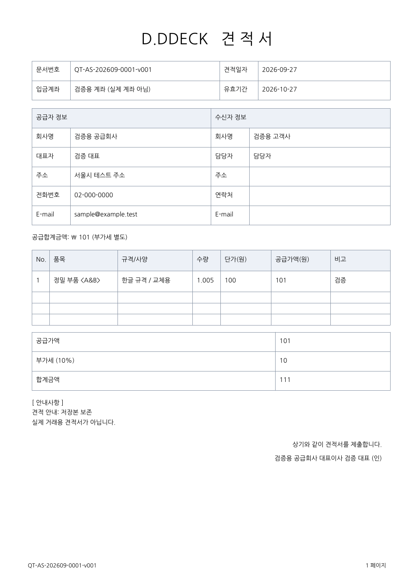

# 견적서 작성·PDF·수정 이력 — 병합 검토

브랜치: `feature/service-work-types` (AS·CS·PO 업무 구분과 같은 브랜치)

## 사용 방법

1. 대응 작성 화면에서 **저장 후 견적서 작성**을 누릅니다. 먼저 대응 건이 저장되며 견적서 화면으로 이동합니다. 기존 건은 상세 화면의 **견적서 작성 · PDF · 수정 이력** 버튼을 누릅니다.
2. **견적서 작성**을 누르고 공급자·수신자, 견적일자·유효기간, 입금계좌, 품목·규격·수량·단가·비고·안내사항을 입력합니다.
3. 공급가액·부가세·합계금액을 확인하고 **새 버전 PDF 생성 · 저장**을 누릅니다.
4. 버전 목록에서 **PDF 열기** 또는 **파일로 저장**을 선택합니다. PDF 열기는 시스템 PDF 뷰어를 이용하며, 인쇄는 뷰어에서 진행합니다.
5. 수정할 때 **최신 견적 수정 · 새 버전 저장**을 누릅니다. 이전 내용을 불러와 수정하며 `v002`, `v003`으로 계속 추가됩니다. 수정 메모, 작성자, 저장 시각, 금액을 버전 목록에서 확인할 수 있습니다.

**견적 화면을 취소해도 앞서 저장한 대응 건은 유지됩니다.** 견적서는 PDF 생성과 DB 저장이 모두 성공했을 때만 새 버전으로 남습니다.

## 회사 양식 반영

docs의 회사 견적서 Excel을 확인해 다음 구성을 A4 PDF로 재구성했습니다.

- D.DDECK / 견적서 제목, 문서번호·견적일자·유효기간·입금계좌
- 공급자 회사명·대표자·주소·전화·이메일, 수신자 회사명·담당자·연락처·이메일
- 품목·규격/사양·수량·단가·공급가액·비고
- 공급가액, 부가세 10%, 합계금액, 안내사항과 제출 문구

Excel 파일을 직접 변환하는 방식은 아닙니다. 원본의 항목과 구성을 바탕으로 재현했으며 하단 제출·대표자 문구는 오른쪽 정렬이며, 가져온 회사 양식의 서명 이미지를 대표자 이름 옆에 표시합니다. 공급자 회사명·대표자가 양식과 일치하는 새 견적에만 적용됩니다. 기존 PDF는 변경하지 않습니다. 네 줄 미만은 빈 품목 줄을 채우고, 많은 품목은 다음 페이지로 이어집니다. 최대 100개 품목까지 지원합니다.

기본 유효기간은 견적일로부터 30일입니다. 원화 정수 단가와 소수 셋째 자리까지의 수량을 사용합니다. 품목별 `수량 × 단가`를 원 단위 반올림한 뒤 합산하고, 공급가액의 10%를 원 단위 반올림하여 부가세를 계산합니다. 앱 미리 계산과 서버 계산은 같은 규칙을 사용합니다.

[가상 데이터로 만든 PDF 보기 (실제 서명 생략)](screenshots/quotations/sample-v001.pdf)



## 기존 파일 보존 방식

- 대응 건별 버전 번호를 부여합니다. 예: `QT-AS-202609-0001-v001_a1b2c3d4.pdf`.
- 각 버전에 작성 당시의 입력값, 계산 금액, PDF 바이트, SHA-256, 작성자·시각을 함께 저장합니다.
- 이전 버전을 덮어쓰거나 수정·삭제하는 API는 없습니다. 공급자 기본값이나 대응 내용이 바뀌어도 이미 저장한 PDF는 바뀌지 않습니다.
- 파일은 서버 DB 안에 원본 PDF 바이트로 보관합니다. DB 백업에 PDF도 포함되며, 내려받은 파일은 사용자가 선택한 위치에 저장됩니다.
- 동시에 같은 버전을 수정하면 한 건만 저장하고 다른 요청은 충돌을 안내합니다. 최신 목록을 확인한 뒤 다시 수정해야 합니다.
- 접근 권한은 기존 대응 건과 같습니다. 로그인한 승인 사용자만 접근할 수 있으며, 삭제된 대응 건의 견적은 접근이 차단됩니다. 대응 건의 삭제는 견적 PDF 자체를 즉시 지우지 않습니다.

## 공급자 기본값 설정

**관리 → 기능 설정 → 서비스(AS)**에서 ‘견적서 기본 공급자 정보’와 ‘견적서 기본 입금계좌’를 설정할 수 있습니다. 공급자 JSON의 키는 `company`, `contact`, `address`, `phone`, `email`입니다. 개별 견적에서도 변경할 수 있습니다.

회사 원본 Excel에서 가져오려면 서버 환경을 지정한 상태에서 아래 도구를 사용합니다. 기본 실행은 검증만 하며 `--apply`를 붙여야 기본값이 저장됩니다.

```bash
cd backend
python scripts/import_quotation_defaults.py '/path/to/견적서.xlsx'
python scripts/import_quotation_defaults.py '/path/to/견적서.xlsx' --apply
```

가져오기 도구는 양식 하단에 배치된 PNG 서명을 함께 읽어 서버의 비공개 설정에 보관합니다. 원본 Excel·서명 이미지·회사 계좌 정보는 소스에 포함하지 않았습니다. 리눅스 검증 환경에는 사용자 제공 양식의 공급자 기본값을 별도로 입력했습니다.

## 검증 및 적용

- Flutter 전체 테스트 235개 통과, 실서버 계약 테스트 19개 건너뜀. 정적 분석 통과.
- 백엔드 기존 전체 스모크 테스트 254개와 업무 구분 회귀 검증 통과.
- 견적서 API 테스트: 원 단위 반올림, 이전 PDF 바이트·해시 보존, 버전 순서, 동시 저장, 권한, 잘못된 입력, PDF 생성 실패 시 롤백, 한글 추출 및 여러 페이지 출력 검증.
- 신규 설치·기존 데이터 업그레이드·되돌리기·모델 일치 검증 통과. 새 테이블을 포함해 31개 테이블입니다.
- 리눅스 빌드 확인. Windows·Android 실제 기기의 PDF 저장 대화상자는 아직 별도 검증하지 않았습니다.

서버 의존성에 ReportLab/Pillow가 추가되며, PDF 검증 개발 의존성에는 pypdf가 추가됩니다. 배포 시 requirements를 갱신해야 합니다. 한글 글꼴과 OFL 라이선스는 `backend/app/assets/fonts`에 포함되어 있습니다. 구현 참고: [ReportLab 글꼴](https://docs.reportlab.com/reportlab/userguide/ch3_fonts/), [표와 페이지 분할](https://docs.reportlab.com/reportlab/userguide/ch7_tables/).

견적서 마이그레이션: `b9a381e076cf → c43194e8a260`. 운영 반영 시 DB 백업 후 `alembic upgrade head`와 새 서버·앱 배포가 필요합니다. 다운그레이드는 견적서 테이블과 PDF를 제거하므로 적용 전 백업이 필요합니다.

**master 병합·릴리스·운영 DB 변경은 하지 않았습니다.** 검증용 서버 `127.0.0.1:18000`만 별도 백업 후 업데이트했습니다. 대응 목록의 **[견적 검증] 구매 견적 예제**에는 v001·v002 예제와 원본 서명·우측 정렬을 적용한 v003을 준비했습니다. 바탕화면 ‘d-ddeck 업무구분 검증’ 바로가기는 새 빌드를 실행합니다. 이미 열린 검증 앱은 닫고 다시 실행해야 새 견적 기능이 표시됩니다.
