# UI 디자인 개선안

검토 기준: 2026-09-26, d-ddeck 1.0.5+5의 [실제 화면 캡처](사용자-가이드.md)와 현재 화면 코드. 우선순위는 사용 빈도·실수 가능성·읽기 부담을 기준으로 제안했습니다. **다크모드와 1~3순위 24개 항목의 구현을 완료했습니다. 아래에 후속 16개 항목의 동작과 검증 범위를 정리했습니다.**

## 이번에 적용한 다크모드

- 로그인 화면 및 로그인 후 오른쪽 위 **화면 모드** 버튼에서 **시스템 설정 / 라이트 모드 / 다크 모드**를 선택합니다.
- 기본값은 시스템 설정입니다. 다크·라이트를 직접 고르면 운영체제 설정과 별개로 적용됩니다.
- 선택은 기기에 저장되어 앱 재실행·로그아웃 후에도 유지됩니다. 같은 기기의 다른 사용자에게도 같은 화면 설정이 적용되며, 다른 기기로 동기화되지는 않습니다.
- 앱이 처음 그려지기 전에 설정을 읽어 시작 시 테마 전환을 줄였습니다.
- 목록·폼·대화상자·팝업은 앱의 공통 테마를 따릅니다. 통계 강조 셀과 근무일지 임시 저장 안내에는 배경과 글자색을 함께 적용했습니다.
- 저장 실패 시 안내를 표시하고 기존 선택을 유지합니다. 저장값이 잘못되었거나 읽을 수 없으면 시스템 설정을 사용합니다.

## 1순위: 매일 쓰는 화면의 읽기와 입력 — 구현 완료

| 번호 | 개선 대상·근거 화면 | 현재 불편 | 제안 | 완료 판단 기준 |
| --- | --- | --- | --- | --- |
| 1 | [대응 목록](images/user-guide/04-service-list.png) | 행마다 여러 정보가 한 줄에 섞이고 제목이 길어짐 | 접수번호·매장·증상·상태·날짜를 일정한 열로 배치하고 모바일은 두 줄 카드 사용 | 같은 항목을 눈으로 세로 비교할 수 있고 긴 제목 전체를 확인 가능 |
| 2 | [대응 검색](images/user-guide/04-service-list.png) | 상세 조건 안에 숨은 필터를 놓치기 쉬움 | 적용 필터를 검색창 아래 칩으로 표시하고 개별 해제·전체 초기화 제공 | 숨겨진 조건 때문에 결과를 오해하지 않음 |
| 3 | [접수 폼](images/user-guide/05-service-form.png) | 세로로 긴 폼에서 후반 입력을 놓침 | 매장·발생·원인·대응·렌탈 구역 이동과 필수 항목 안내 제공 | 누락 항목 안내를 누르면 해당 입력으로 이동 |
| 4 | [접수 폼](images/user-guide/05-service-form.png) | 초기 원인 입력 공간이 커 핵심 입력이 밀림 | 첫 원인만 펼치고 추가 원인은 사용자가 추가하도록 구성 | 최초 접수의 필수 입력을 적은 스크롤로 완료 |
| 5 | [AS 상세](images/user-guide/25-service-detail.png) | 종결·작업 기록 같은 핵심 동작이 긴 본문 아래에 위치 | 상태와 주요 작업 버튼을 상단 또는 고정 하단에 배치 | 긴 기록에서도 핵심 동작 접근이 유지됨 |
| 6 | [장비 목록](images/user-guide/09-assets.png) | 장비 수가 많을 때 작은 글씨·메뉴를 반복 확인 | S/N 열 고정, 행 hover·선택 강조, 중요 열 너비 확보 | 긴 시리얼이 잘리지 않고 선택 대상이 분명함 |
| 7 | [장비·매장 현황](images/user-guide/07-equipment.png) | 일부 상태가 IN_STOCK 등 코드로 노출 | 상태 코드에 일관된 한국어 표시 이름 적용 | 사용자 화면에 설명 없는 내부 코드가 남지 않음 |
| 8 | [앱 메뉴](images/user-guide/03-dashboard.png) | 아이콘만 표시되는 접힌 메뉴는 초보자에게 어려움 | 넓은 화면에서 메뉴 이름 기본 표시, 접힘 상태 기기별 저장 | 첫 사용자가 아이콘 의미를 추측할 필요가 없음 |

## 2순위: 정보 구조와 화면 밀도 — 구현 완료

| 번호 | 개선 대상·근거 화면 | 현재 불편 | 제안 | 완료 판단 기준 |
| --- | --- | --- | --- | --- |
| 9 | [홈](images/user-guide/03-dashboard.png) | 긴 미종결 목록이 화면 대부분을 차지 | 지연 대응·오늘 일정·회수 예정으로 구역을 나누고 목록 길이 제한 | 오늘 우선 처리할 항목을 첫 화면에서 파악 |
| 10 | [매장](images/user-guide/08-stores.png) | 소수 브랜드만 있을 때 빈 공간이 큼 | 브랜드 카드에 운영·폐점·미종결 수를 정리하고 최근 매장 제공 | 브랜드 선택 전에 업무량을 비교 가능 |
| 11 | [매장 상세](images/user-guide/26-store-detail.png) | 장비·구분별 현황·렌탈·사진의 중요도가 비슷해 보임 | 매장 기본 정보와 운영 상태를 먼저, 장비·대응·사진을 탭으로 구성 | 핵심 상태와 원하는 상세 영역을 빠르게 찾음 |
| 12 | [자동 통계](images/user-guide/06-service-stats.png) | 가로로 많은 탭과 표가 한꺼번에 노출 | 요약·추이·분류 분석·원본 검증으로 묶고 기간을 항상 표시 | 그래프·엑셀의 조회 범위를 바로 확인 가능 |
| 13 | [게시판](images/user-guide/12-boards.png) | 게시글 목록이 작고 빈 영역이 큼 | 제목 크기·행 높이를 조정하고 작성자·날짜·첨부·공지 표시 정렬 | 읽지 않은 공지와 새 자료를 구분 가능 |
| 14 | [캘린더](images/user-guide/13-calendar.png) | 일정이 적으면 큰 달력에 비해 당일 정보가 약함 | 데스크톱에 선택 날짜 일정 패널, 모바일에 날짜 아래 목록 강화 | 날짜를 선택한 뒤 일정 내용을 바로 읽음 |
| 15 | [계정·승인](images/user-guide/21-accounts.png) | 작은 역할 칩과 메뉴에 관리 작업이 집중 | 계정 상세 패널에 상태·권한·부서·세션을 구분하고 위험 작업 분리 | 대상 계정과 변경 결과를 확인 후 실행 가능 |
| 16 | [로그인](images/user-guide/01-login.png) | 넓은 화면의 여백 대비 연결 상태 안내가 작음 | 서버 표시 이름·연결 상태를 로그인 카드 안에 간결하게 표시 | 어느 서버에 로그인하는지 명확함 |

## 3순위: 일관성과 접근성 — 구현 완료

| 번호 | 대상 | 제안 | 완료 판단 기준 |
| --- | --- | --- | --- |
| 17 | 버튼·명칭 | ‘장비/자산’, ‘등록/저장’, ‘종결/완료’를 업무별로 정리하고 아이콘 전용 주요 버튼에 텍스트 제공 | 같은 작업의 이름과 위치가 화면마다 달라지지 않음 |
| 18 | 빈 화면 | 첫 등록 안내·검색 초기화·권한 부족을 구분한 메시지와 다음 동작 제공 | ‘자료 없음’의 이유와 다음 행동을 이해 가능 |
| 19 | 로딩·실패 | 목록은 이전 결과를 유지하며 갱신 상태 표시, 오류는 해당 영역에서 재시도 | 재조회 시 화면 전체가 깜빡이거나 입력이 사라지지 않음 |
| 20 | 첨부 | 썸네일·파일명·용량·업로드 상태를 묶고 사진 분류를 눈에 띄게 표시 | 실패한 파일과 완료한 파일을 혼동하지 않음 |
| 21 | 키보드·확대 | 탭 순서·포커스 강조·팝업 복귀·글자 확대 점검 | 마우스 없이 핵심 업무 가능, 확대 시 버튼·문구 잘림 없음 |
| 22 | 색상·상태 | 상태는 색뿐 아니라 텍스트·아이콘으로 표시하고 사용자 지정 일정색 대비 점검 | 라이트·다크 모두 상태를 식별할 수 있음 |
| 23 | 화면 밀도 | 데스크톱 목록에 기본/촘촘히 보기 제공, 터치 화면은 충분한 누름 영역 유지 | 동일 데이터가 환경별 적절한 밀도로 표시됨 |
| 24 | 저장 피드백 | 저장 완료에 대상 번호를 표시하고 다음 작업·상세 보기로 연결 | 저장 결과와 후속 동작이 명확함 |

## 적용 순서 제안

1. 대응 목록·검색·접수·상세를 하나의 흐름으로 먼저 개선합니다.
2. 장비·매장 화면의 표와 상태 명칭을 통일합니다.
3. 홈·통계·캘린더·관리 화면의 정보 배치를 개선합니다.
4. 라이트·다크, 넓은 화면·좁은 화면, 키보드·글자 확대 조건으로 확인합니다.

기존 사용자 가이드의 28장은 변경 전 라이트 화면입니다. 다크모드가 Windows·Android 실기기에서 모두 검수되었다는 의미는 아니며, 실제 배포 전 해당 플랫폼에서 글꼴·시스템 대화상자·알림 화면을 확인해야 합니다.

## 1차 구현 결과 · 2026-09-26

| 번호 | 적용 내용 |
| --- | --- |
| 1 | 대응 목록의 접수번호·매장/브랜드·발생 내용·발생일·대응일·상태를 공통 비율의 열로 정렬. 좁은 화면·큰 글자에서는 카드로 전환하며 긴 제목에 전체 내용 툴팁 제공. 분류·인원·첨부·기록 정보는 보조 행에 유지. |
| 2 | 상세 조건을 닫아도 적용 필터가 보이며 칩의 삭제 버튼으로 개별 해제. 연도 해제 시 월, 브랜드 해제 시 매장, 서비스구분 해제 시 세부분류도 함께 해제. 전체 초기화 유지. |
| 3 | 매장·발생·원인·대응·렌탈·기타 바로가기와 필수 안내 추가. 저장 시 누락 항목을 모아서 표시하고 항목 클릭 시 해당 입력 위치로 이동. |
| 4 | 신규 접수의 서비스구분을 1개로 시작. 추가 버튼으로 최대 10개까지 입력. 기존 기록을 수정할 때는 저장된 원인들을 유지. |
| 5 | 접수번호·현재 상태와 종결/다시 열기·상태 변경·작업 기록을 상세 상단에 고정. 본문을 내려도 주요 작업 버튼 유지. 좁은 화면은 버튼 영역 가로 스크롤. |
| 6 | 데스크톱 장비 표의 S/N 열 고정, 나머지 열 가로 스크롤. 행 마우스 강조와 선택 색상, 긴 시리얼·품명·위치 툴팁 적용. 모바일 카드 유지. |
| 7 | 장비 현황 표의 기본 상태 코드를 재고·사용중·수리중·대여중·폐기·분실로 표시. 서버 사용자 정의 상태 이름은 유지. |
| 8 | 넓은 화면의 메뉴 이름을 기본으로 표시. 사용자의 펼침/접힘 선택을 기기에 저장하고 다음 실행 시 복원. |

검증: 정적 분석 오류 없음. 전체 앱 테스트 115개 통과, 기존 실서버 의존 테스트 19개 생략. 새 회귀 테스트는 390/1440 폭 필터 해제, S/N 고정과 체크박스·행 선택, 대응 목록 반응형 표시를 확인합니다. 별도 시험 서버를 연결한 Linux 실제 앱 실행에서도 신규 원인 1개, 필수 입력 검증, 스크롤 후 종결 버튼 접근과 장비 화면 표시를 확인했습니다. Windows·Android 실기기 검수와 운영 배포는 별도입니다.

### 변경 후 실제 화면

다음 화면은 별도 시험 데이터로 실행한 Linux 개발용 앱의 다크모드 캡처입니다. 기존 가이드의 라이트 화면과 비교할 수 있습니다.

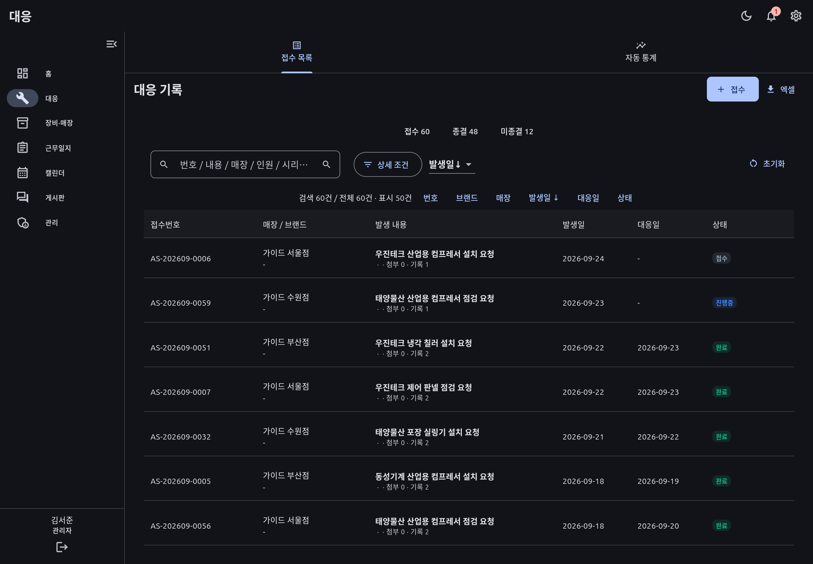

접수번호, 매장, 발생 내용, 날짜, 상태를 같은 열에서 비교합니다.

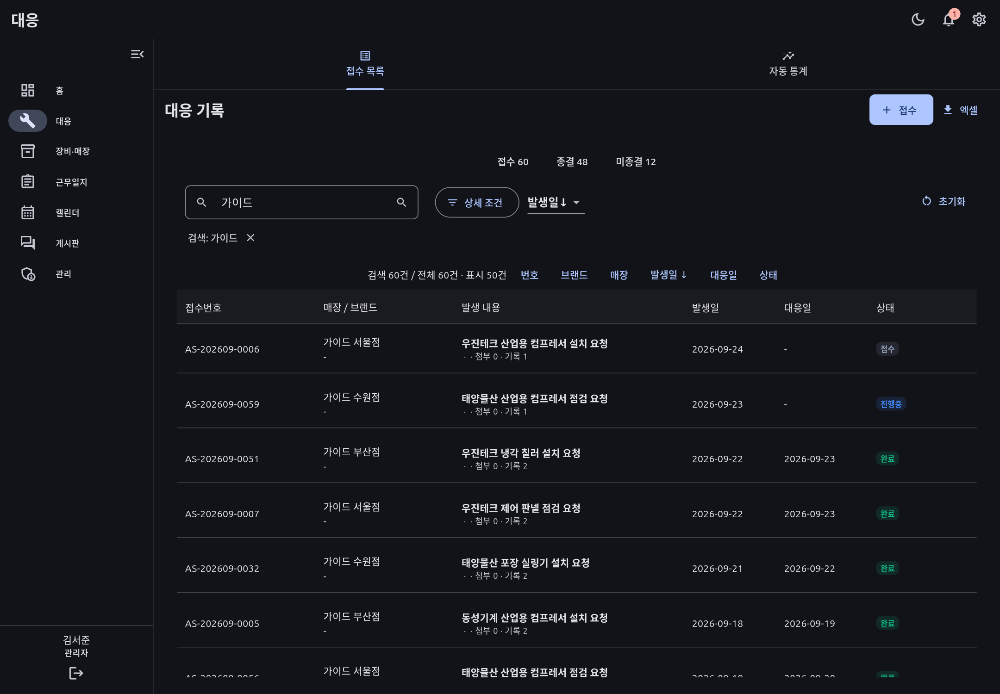

검색 조건은 입력창 아래 칩으로 표시하며 삭제 버튼으로 해제합니다.

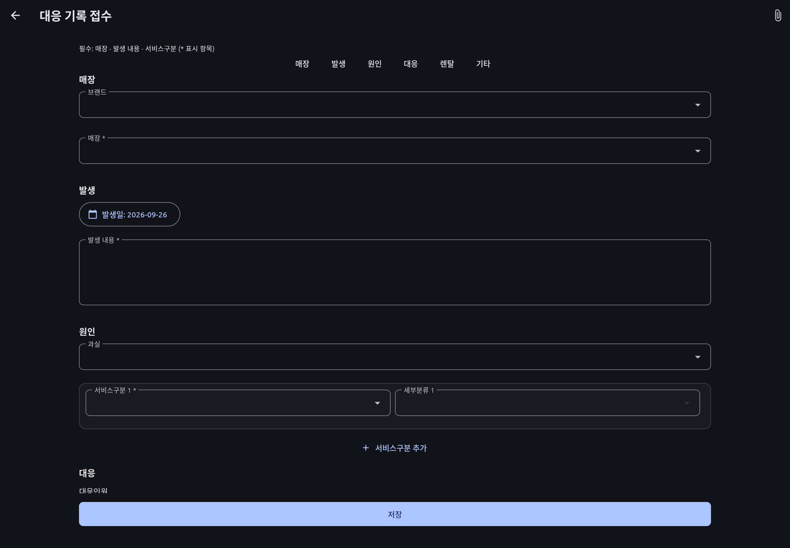

구역 바로가기와 필수 항목 안내, 첫 번째 서비스구분을 제공합니다.

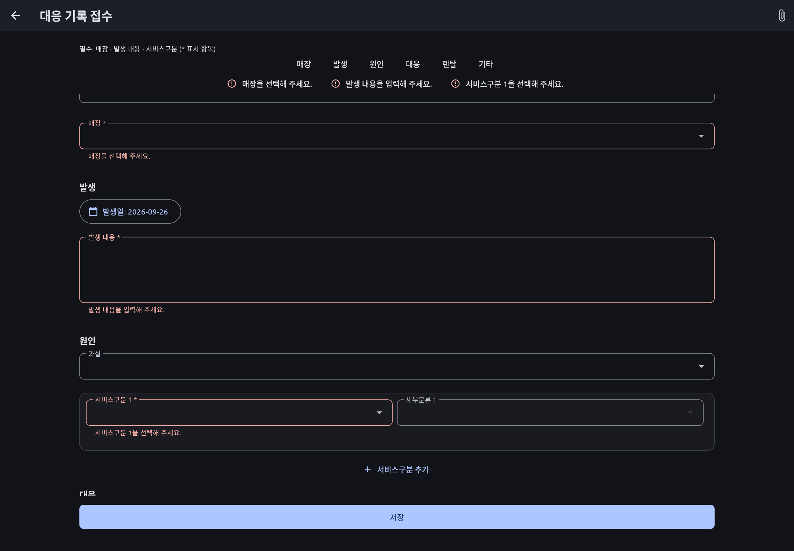

저장 시 누락된 항목을 상단에 모아 보여 주고 해당 입력으로 이동합니다.

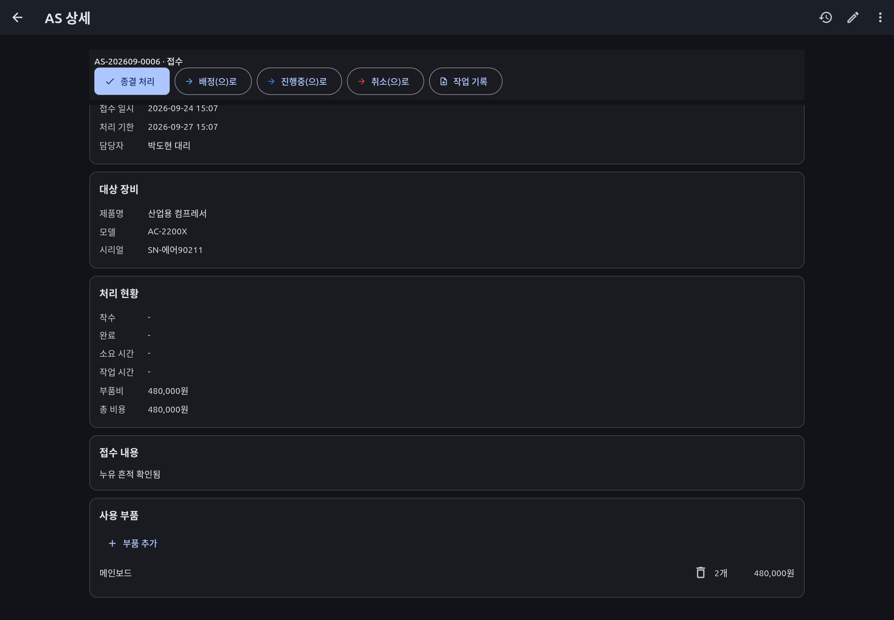

상세 본문을 내려도 종결·상태 변경·작업 기록 버튼이 남아 있습니다.

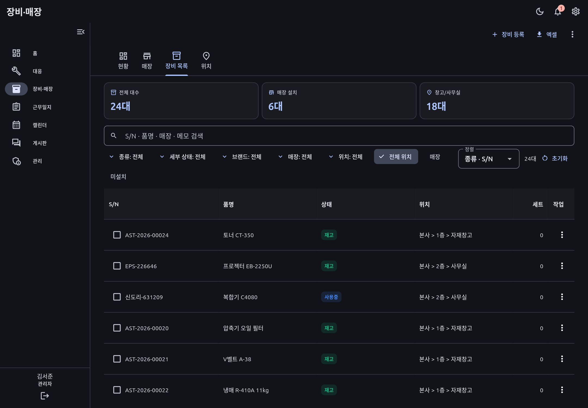

S/N을 왼쪽에 고정한 상태에서 나머지 열을 가로로 이동할 수 있습니다.

## 2차 구현 결과 · 나머지 16개 항목

| 번호 | 적용 내용 및 사용 방법 |
| --- | --- |
| 9 | 홈 상단의 오늘 일정·기한 우선 미종결 대응·미회수 렌탈을 구분. 넓은 화면에서는 나란히 표시하고 좁거나 글자가 크면 세로 배치. 일정·렌탈·일반 목록은 최대 3건, 기한 우선 대응은 5건. 기한 없는 대응은 마지막에 정렬. |
| 10 | 브랜드별 운영·폐점·미종결 수 표시. 브랜드 개수에 따라 카드 폭을 조정하고, 최근 대응 시각 순 매장 5곳을 바로 여는 버튼 추가. 최근 열람 이력과는 별개입니다. |
| 11 | 매장 상세 상단에 이름·브랜드·운영 상태·장비/미종결 수 표시. 기본 정보 / 장비 / 대응·렌탈 / 사진·첨부 탭으로 분리. 탭별 스크롤 위치 유지. |
| 12 | 통계를 요약 / 추이 / 분류 분석 / 원본 검증으로 구분. 서비스구분 선택은 드롭다운으로 제공. 조회 범위를 상단에 고정하며 현재 통계 기간은 **전 기간**. 브랜드·서비스구분 조건은 화면과 전체 통계 Excel에 동일하게 적용. |
| 13 | 게시글 제목·작성자·날짜·조회 수·첨부 수·공지·안 읽음 표시. 본문 조회에 성공하면 읽음 처리. 읽음 기록은 서버·계정·게시판별로 기기에 최근 500개까지 저장하며 기기간 동기화하지 않음. 서버에서 삭제된 첨부는 수량에서 제외. |
| 14 | 넓은 캘린더는 선택 날짜와 일정 목록을 오른쪽에 표시. 좁은 화면에서는 달력 아래 표시. 선택 날짜의 일정 등록 버튼 제공. |
| 15 | 계정 행을 누르면 정보·권한·부서·최근 로그인·활성 세션을 상세 창에서 확인. 정지/비밀번호 초기화/삭제는 주의 필요한 작업에 분리. 세션은 서버에서도 관리자와 대상 계정의 권한을 검사하고 비밀 토큰은 반환하지 않음. |
| 16 | 로그인 카드 안에 접속 서버 호스트와 연결 확인 버튼·결과 표시. 서버 주소 변경은 연결 설정에서 수행. |
| 17 | 주요 장비 화면의 자산 명칭을 장비로 정리, 대응 완료 상태는 종결로 표기. 게시글 신규는 등록·수정은 저장. 넓은 작성 화면의 첨부 동작에 ‘저장 후 첨부’ 텍스트 제공, 좁은 화면은 툴팁 아이콘 유지. |
| 18 | 대응·게시판의 첫 등록 상태와 조건 검색 결과 없음을 구분. 검색 초기화·등록·재시도 제공. 접근 거부는 서버 안내로 표시하며 접근 불가 자료를 남기지 않음. |
| 19 | 공통 조회 화면과 주요 목록은 갱신 중 이전 자료를 유지하고 진행 표시. 일시 오류는 이전 자료 안내와 재시도 제공. 뒤늦게 도착한 응답은 무시하고, 401/403/404의 공통 조회 결과는 제거. 재조회 중 같은 입력 위젯의 초안 유지. |
| 20 | 사진 분류명·파일명·용량 표시, 이미지 버튼을 누르면 인증 후 썸네일 불러오기. 파일별 업로드 성공/실패를 따로 표시하며 실패 파일은 다시 선택해 추가. 긴 파일명은 두 줄로 제한. |
| 21 | 주 메뉴 Alt+1~7 이동, 대응 작성 Ctrl+Enter 저장, 포커스 강조와 탐색 그룹 적용. 핵심 대응 카드와 첨부 동작을 390px·200% 글자로 확인. |
| 22 | 지연·미종결 등 상태에 문구/아이콘 병행. 통계 색상 위 글자를 밝기에 따라 검정/흰색으로 선택. 일정색과 색상 선택기의 밝기 기반 대비 처리 유지. |
| 23 | 넓은 화면 오른쪽 위 ‘목록 밀도’에서 기본 간격/촘촘히 선택. 공통 표와 대응·장비 행 간격에 반영하고 기기에 저장. 900px 미만 창은 기본 밀도로 표시. |
| 24 | 대응·근무일지·게시글·일정 저장 시 번호·일자·제목 등 대상과 ‘상세 보기’ 동작 제공. 매장 저장은 이름, 장비 일괄 등록은 생성/중복/실패 결과를 표시. |

검증: 앱 정적 분석 오류 없음. 앱 테스트 119개 통과, 기존 실서버 의존 테스트 19개 생략. 신규 테스트에서 재조회 경쟁 응답·초안 보존·일시 오류·권한 회수·설정 복원·390px/200% 확대·키보드 실행을 확인했습니다. 백엔드 기본 회귀 254개와 추가 UI API 회귀(세션 권한 6가지, 세션 종료, 토큰 미노출, 첨부 수·작성자)를 통과했습니다.

Windows·Android 실기기 검수 및 운영 서버 배포는 포함하지 않습니다. 아래 캡처는 합성 시험 데이터로 실행한 Linux 개발 앱입니다.

### 2차 변경 후 실제 화면

실제 Linux 앱에서 12개 화면을 캡처했습니다. 시험용 화면의 상단 일부 제목은 검증 경로를 표시합니다.

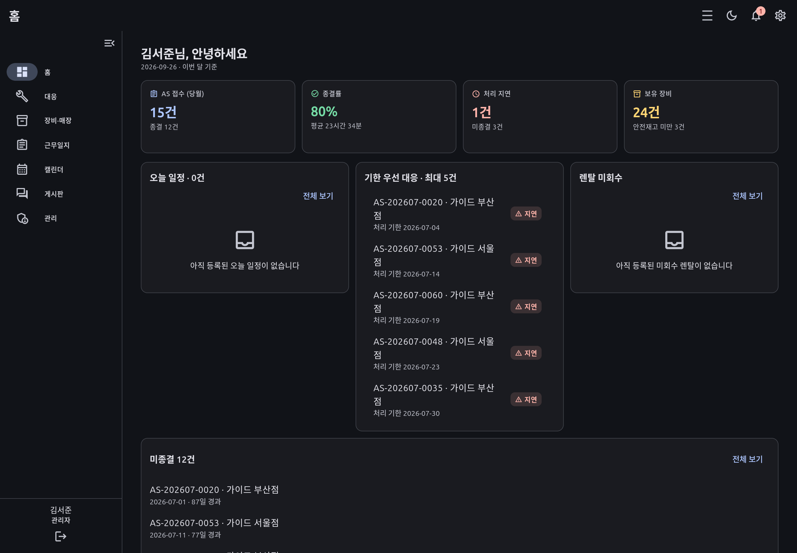

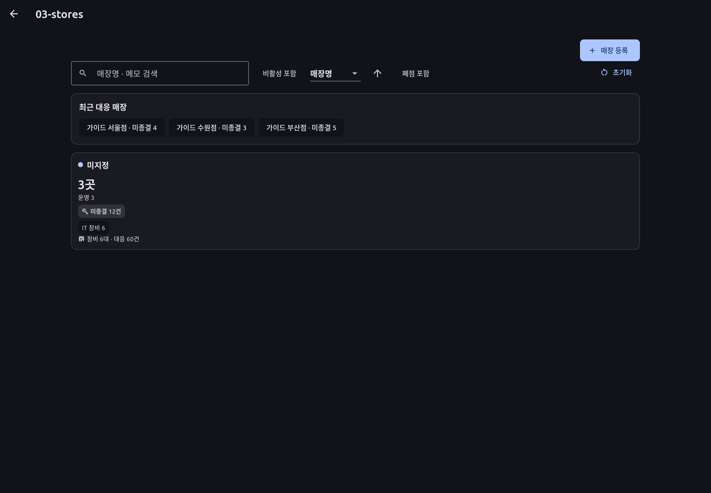

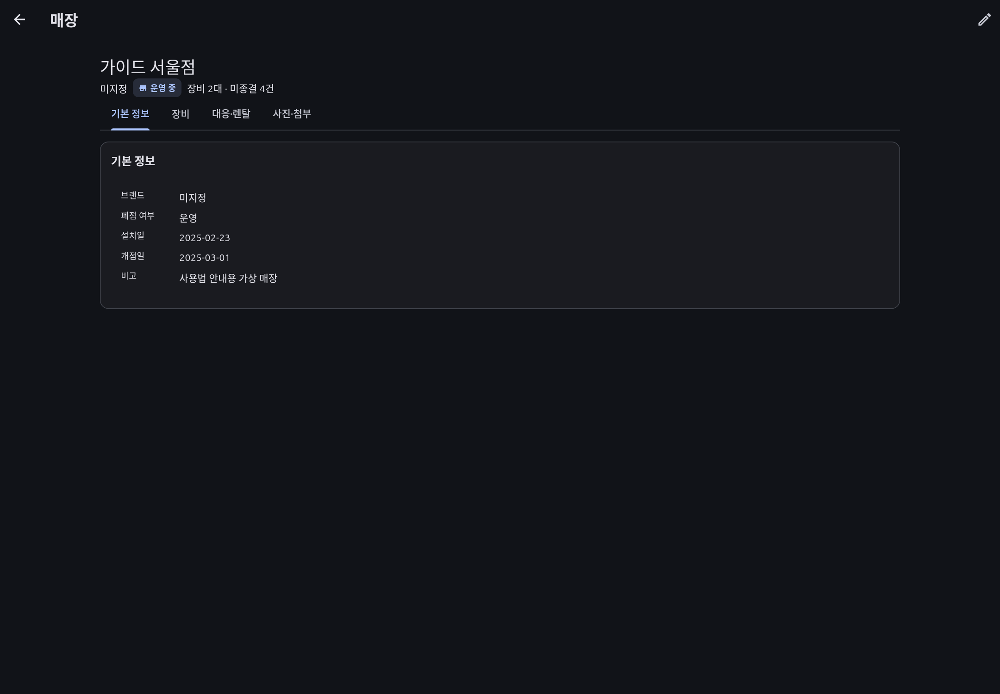

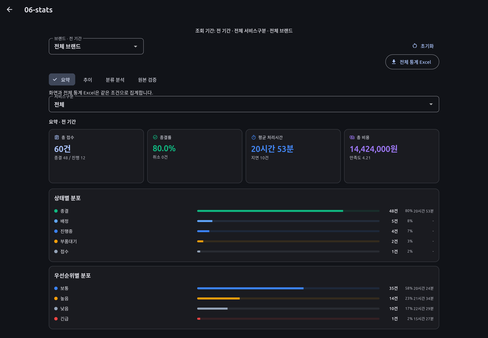

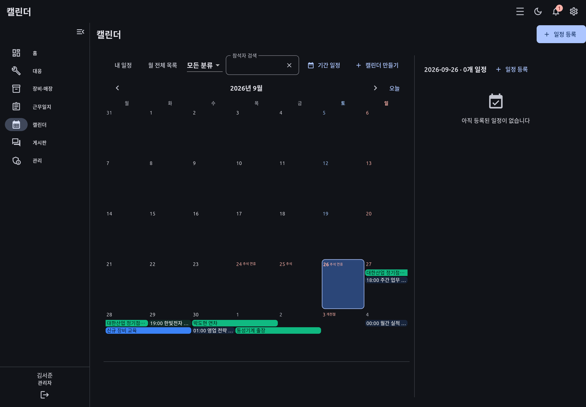

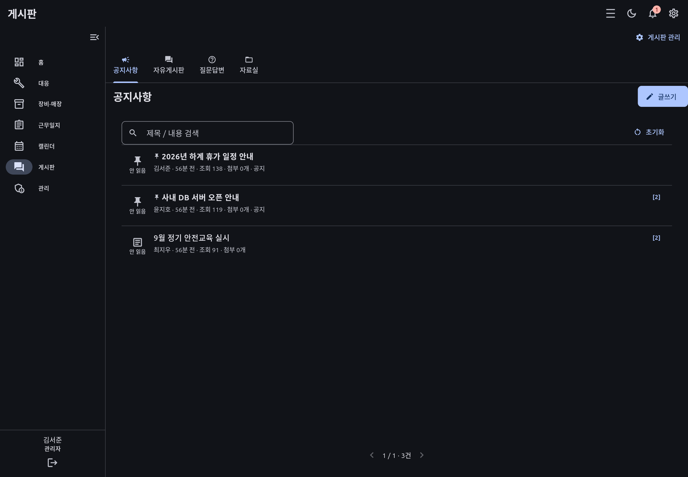

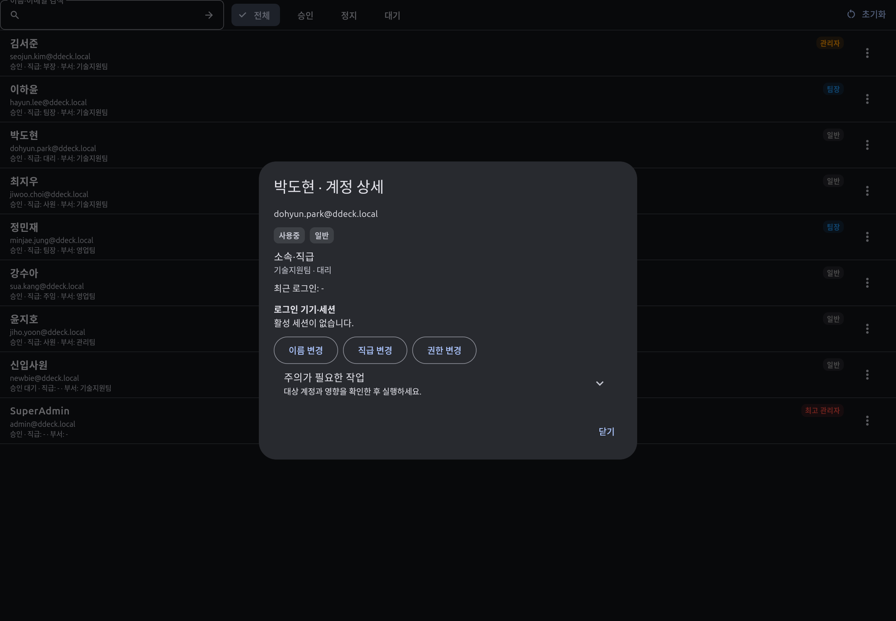

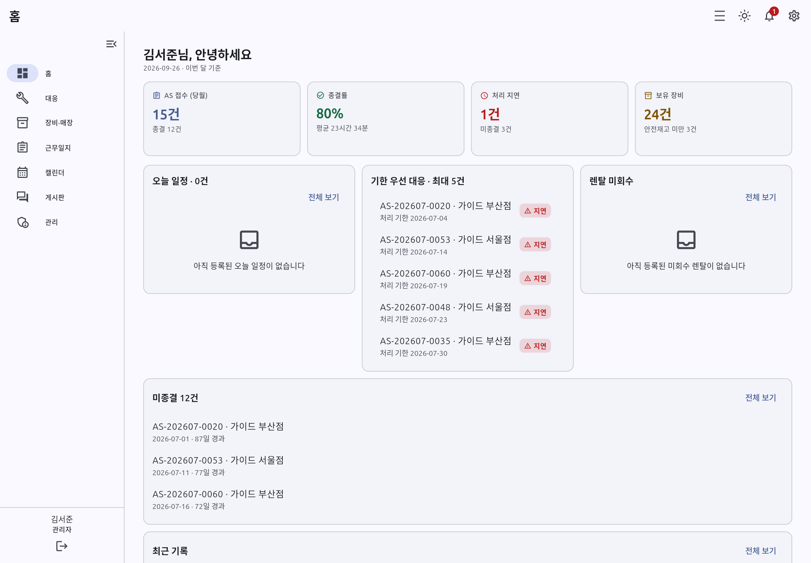

나머지 캡처: [로그인 서버 표시](images/ui-priority23/01-login.png), [사진·첨부 탭](images/ui-priority23/05-store-photos.png), [계정 목록](images/ui-priority23/09-accounts.png), [촘촘한 밀도](images/ui-priority23/11-density-home.png).

Linux 실제 앱에서 로그인·매장 상세 탭 전환·통계 조회·메뉴 이동·계정 상세 열기·밀도 및 테마 전환을 확인했으며 화면 렌더링 오류 없이 통과했습니다.
