# d-ddeck 사용자 가이드

**대상 버전: 1.0.7+7 · 작성일: 2026-09-26**

매장별 AS 대응, 장비와 재고, 근무일지, 일정, 게시판을 한곳에서 사용하는 방법을 설명합니다. 처음 사용하는 직원은 1~3장을 읽은 뒤 담당 업무에 해당하는 장으로 이동하세요. 관리자는 11장까지 확인하세요.

> 화면은 Linux 데스크톱에서 실제 Flutter 앱을 실행하고 별도의 시험 서버에 연결하여 캡처했습니다. 등장하는 사용자·연락처·매장·업무는 안내용 예시입니다. Windows에서도 같은 앱 화면을 사용하지만 창 테두리와 파일 선택 창은 다를 수 있습니다. Android 전용 VPN·기기 알람은 설명으로 안내하며, 이 문서의 데스크톱 화면을 Android 실기기 캡처로 표시하지 않습니다. 운영 서버의 데이터는 사용하지 않았습니다.

## 목차

1. [처음 시작하기](#처음-시작하기)
2. [화면 구성과 공통 조작](#화면-구성과-공통-조작)
3. [홈에서 오늘 할 일 확인](#홈에서-오늘-할-일-확인)
4. [AS 대응 업무](#as-대응-업무)
5. [매장과 장비 관리](#매장과-장비-관리)
6. [게시판](#게시판)
7. [캘린더와 일정](#캘린더와-일정)
8. [근무일지](#근무일지)
9. [알림과 Android 기기 설정](#알림과-android-기기-설정)
10. [내 정보와 로그인 기기](#내-정보와-로그인-기기)
11. [관리자 업무](#관리자-업무)
12. [자주 발생하는 상황](#자주-발생하는-상황)
13. [업무별 빠른 순서표](#업무별-빠른-순서표)

## 처음 시작하기

### 1. 접속 주소 확인과 로그인

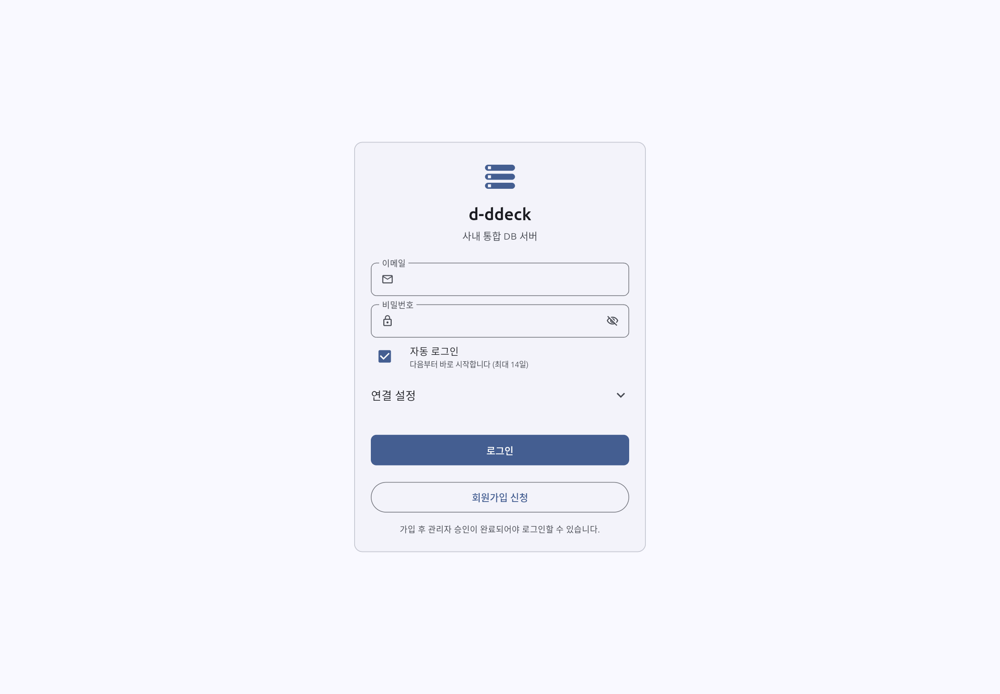

*화면 01. 로그인: 서버 주소를 확인하고 승인된 계정으로 접속합니다.*

1. 회사에서 설치한 d-ddeck 앱을 실행합니다.
2. 로그인 화면의 서버 주소가 관리자가 안내한 주소인지 확인합니다. **연결 설정**을 펼쳐 안내받은 주소를 입력하고 **연결 확인**을 누르세요. 화면의 `127.0.0.1:18765`는 캡처용 주소이므로 그대로 사용하지 않습니다.
3. 가입한 **이메일**과 **비밀번호**를 입력합니다.
4. 개인 업무 기기라면 **자동 로그인**을 선택할 수 있습니다. 공용 PC에서는 선택을 해제하고, 사용 후 로그아웃합니다.
5. **로그인**을 누릅니다. 승인된 계정은 홈으로 이동합니다. 비밀번호 변경 화면이 먼저 나오면 새 비밀번호를 설정한 뒤 다시 로그인합니다.

서버 주소는 회사 서버의 주소입니다. 휴대폰에서 `localhost`나 `127.0.0.1`을 입력하면 휴대폰 자신을 가리키므로 회사 서버에 연결되지 않습니다. 사내망 또는 VPN 접속이 필요한 서버라면 먼저 해당 네트워크에 연결하세요.

### 2. 계정이 없다면 가입 신청

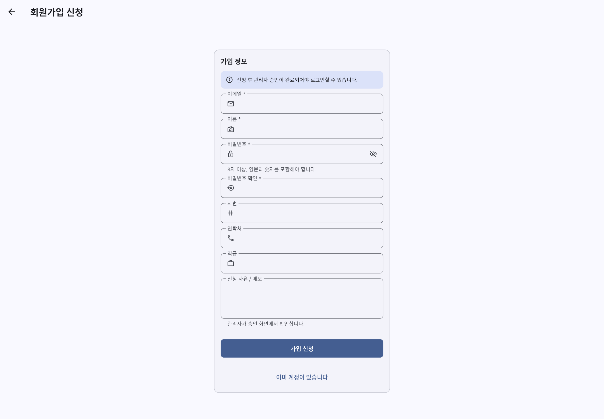

*화면 02. 가입 신청: 필수 정보와 관리자가 확인할 신청 사유를 작성합니다.*

1. 로그인 화면에서 **회원가입 신청**을 누릅니다.
2. 이메일, 이름, 비밀번호, 비밀번호 확인을 입력합니다. 별표가 붙은 항목은 필수입니다.
3. 비밀번호는 화면에 표시된 조건을 충족해야 합니다. 현재 화면 안내는 **8자 이상, 영문과 숫자 포함**입니다.
4. 사번, 연락처, 직급, 신청 사유·메모를 입력합니다. 동명이인이 있으면 소속과 업무를 신청 사유에 적어 두면 승인에 도움이 됩니다.
5. **가입 신청**을 누르고 관리자에게 승인을 요청합니다.
6. 승인 후 로그인합니다. 신청만으로 즉시 사용 권한이 생기지는 않습니다.

이미 가입했다면 새 계정을 반복 신청하지 말고 관리자에게 승인 상태나 비밀번호 초기화를 문의하세요.

### 3. 권한 이해하기

| 역할 | 주로 하는 일 | 알아둘 제한 |
| --- | --- | --- |
| 일반 사용자 MEMBER | 권한이 허용된 업무 조회·등록, 자신의 일정·근무일지 작성 | 관리 메뉴와 관리자 전용 작업은 표시되지 않거나 거절됩니다. |
| 팀장 MANAGER | 일반 업무와 허용된 AS·장비 삭제 등 | 관리자와 동일한 권한은 아닙니다. |
| 관리자 ADMIN | 가입 승인, 하위 권한 계정 관리, 기능 설정, 매장 폐점·장비 설정 | 자신과 동급·상위 계정의 민감한 변경은 제한될 수 있습니다. |
| 최고관리자 SUPERADMIN | 최고 수준의 계정·운영 관리 | 마지막 최고관리자 보호 등 서버 규칙이 적용됩니다. |

게시판 공개 범위, 일정 소유권, 근무일지 공개 범위처럼 개별 자료에도 접근 규칙이 있습니다. 메뉴가 보이는 것과 모든 자료를 수정할 수 있는 것은 다릅니다.

## 화면 구성과 공통 조작

### 라이트·다크모드 선택

로그인 화면 또는 로그인 후 오른쪽 위 **화면 모드** 아이콘을 누르고 **시스템 설정 / 라이트 모드 / 다크 모드**를 선택합니다. 기본값인 시스템 설정은 운영체제의 밝기 설정을 따릅니다. 선택은 기기에 저장되어 재실행·로그아웃 후에도 유지되며 다른 기기와 동기화되지 않습니다. 아래 캡처는 UI 개선 전의 라이트 화면입니다. [최신 화면과 변경된 조작 방법](UI-디자인-개선안-2026-09-26.md)을 함께 확인하세요.

### 개선된 화면 사용법

- **홈:** 오늘 일정·기한 우선 대응·미회수 렌탈에서 먼저 처리할 대상을 확인합니다. 행을 누르면 상세 화면으로 이동합니다.
- **매장:** 최근 대응 매장 버튼으로 바로 이동하거나 브랜드를 선택합니다. 상세는 기본 정보, 장비, 대응·렌탈, 사진·첨부 탭으로 나뉩니다.
- **통계:** 요약·추이·분류 분석·원본 검증을 선택합니다. 상단 조회 범위는 전 기간이며, 브랜드와 서비스구분 조건을 바꾸면 Excel에도 같은 조건이 적용됩니다.
- **게시판:** 공지·안 읽음과 첨부 수를 확인합니다. 본문을 정상 조회하면 이 기기에서 읽음으로 표시됩니다.
- **계정:** 관리자 화면에서 계정 행을 눌러 상세 정보와 허용된 대상의 활성 세션을 확인합니다. 정지·초기화·삭제는 ‘주의 필요한 작업’을 펼쳐 실행합니다.
- **첨부:** 이미지 아이콘을 눌러 썸네일을 불러옵니다. 여러 파일을 추가하면 파일별 완료·실패 결과가 표시됩니다. 실패한 파일은 다시 선택합니다.
- **목록 밀도:** 넓은 화면 오른쪽 위에서 기본 간격 또는 촘촘히를 선택합니다. 선택은 기기에 저장되며 좁은 화면은 기본 간격을 사용합니다.
- **키보드:** Alt+1~7로 주 메뉴 이동, 대응 작성에서 Ctrl+Enter로 저장합니다. Tab으로 버튼과 입력창을 이동하고 Enter로 실행할 수 있습니다.
- **저장 후 이동:** 저장 안내의 대상 번호·제목을 확인하고 ‘상세 보기’를 누릅니다. 첨부를 이어서 추가하려면 작성 화면에서 ‘저장 후 첨부’를 사용합니다.
- **새로고침 실패:** 이전 자료라는 안내가 있으면 ‘다시 시도’를 누릅니다. 일시 오류 동안 초안과 이전 목록은 유지되며 권한이 사라진 자료는 제거됩니다.

위 세 장은 개선 후 Linux 시험 앱의 다크모드 화면입니다. 아래 각 업무의 기존 라이트 캡처와 배치가 다를 수 있지만 기능과 권한은 동일합니다.

최신 화면 캡처와 항목별 적용 범위는 [UI 개선 결과](UI-디자인-개선안-2026-09-26.md#2차-구현-결과--나머지-16개-항목)에서 확인합니다.

### 메뉴와 입력

- **넓은 화면:** 왼쪽 메뉴에서 홈, 대응, 장비·매장, 근무일지, 캘린더, 게시판으로 이동합니다. 관리자에게는 관리 메뉴가 추가됩니다. 왼쪽 위 메뉴 아이콘으로 메뉴 이름을 펼치거나 접습니다.
- **좁은 화면:** 하단 메뉴와 더보기 메뉴를 사용합니다. 검색 조건이 접혀 있으면 검색 조건 영역을 먼저 펼칩니다.
- **오른쪽 위:** 알림과 계정 메뉴가 있습니다. 계정 메뉴에서 내 정보, 비밀번호, 로그인 기기·세션 등의 기능으로 이동합니다.
- **목록:** 행이나 카드를 누르면 상세 화면으로 이동합니다. 검색 결과가 많으면 아래로 이동하여 다음 데이터를 불러오거나 더보기 기능을 사용합니다.
- **입력 화면:** 별표 항목을 먼저 입력합니다. 긴 입력 화면은 아래로 스크롤해야 나머지 항목이 보입니다.
- **저장:** 저장 완료 안내를 확인하세요. 작성 중 뒤로 이동하면 저장하지 않은 변경을 확인하는 창이 나타날 수 있습니다.
- **새로고침:** 서버 오류나 통신 중단 후에는 연결을 복구한 다음 다시 시도를 누릅니다. 저장 결과가 불확실하면 목록을 확인한 뒤 다시 등록하여 중복을 피합니다.

### 파일과 사진 첨부

자료 상세 화면의 첨부 영역을 사용합니다. 신규 작성 화면에 **저장 후 첨부**가 있으면 먼저 본문을 저장하고 이어서 첨부 화면으로 이동합니다.

1. 첨부 버튼을 눌러 파일을 선택합니다.
2. 업로드 진행과 완료를 확인합니다. 본문 저장과 파일 업로드는 별도 단계입니다.
3. 이미지 파일은 미리보기로 확인하고, 일반 파일은 내려받아 기본 프로그램으로 엽니다.
4. 첨부가 보이지 않으면 상세 화면을 새로고침합니다. 용량·형식 제한 안내가 나오면 해당 제한에 맞춰 파일을 준비합니다.
5. 첨부 삭제 버튼은 권한이 있을 때 사용합니다. 잘못 삭제하지 않도록 파일명을 먼저 확인하세요.

## 홈에서 오늘 할 일 확인

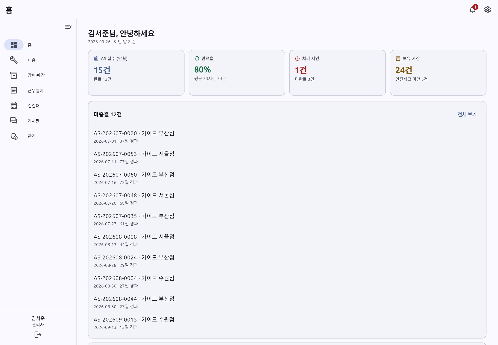

*화면 03. 홈: 현재 업무 현황을 요약해서 보여 줍니다.*

1. 로그인 후 당월 AS 접수, 완료율, 보유 자산 등 요약 수치를 확인합니다.
2. 미종결·지연 대응이나 회수 예정 렌탈을 확인하고 우선 처리할 항목을 정합니다.
3. 연결된 카드나 항목을 누르면 해당 조건의 목록 또는 상세 화면으로 이동합니다.
4. 수치가 예상과 다르면 조회 기간과 업무 상태를 확인합니다. 홈의 요약과 특정 필터를 적용한 목록은 집계 범위가 다를 수 있습니다.

## AS 대응 업무

### 1. 접수 목록 찾기

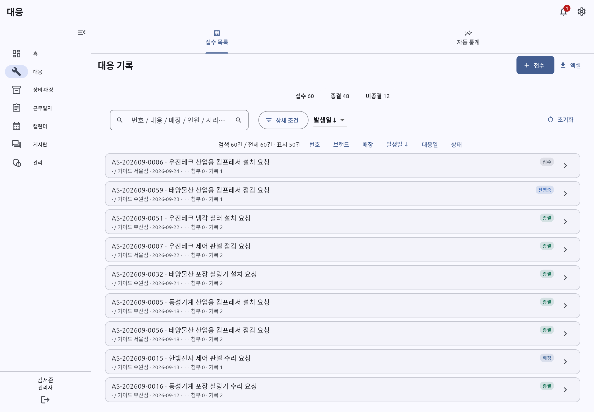

*화면 04. 대응 → 접수 목록: 검색 조건과 상태별 수치를 확인합니다.*

1. 왼쪽 **대응**을 선택하고 **접수 목록**을 엽니다.
2. 검색어를 입력하고 **상세 조건**을 열어 필요한 조건을 지정합니다. 연도·월, 브랜드·매장, 서비스구분·세부분류, 상태, 제조사, 과실, 대응인원, 렌탈 등 제공되는 조건을 조합할 수 있습니다.
3. 검색 결과 수와 전체 수를 구분해 확인합니다. 현재 화면에 불러온 행 수가 전체 검색 결과 수와 같지 않을 수 있습니다.
4. 정렬 항목을 바꾸어 발생일·매장·상태 등 원하는 순서로 확인합니다.
5. 원하는 행을 누릅니다. 자료가 보이지 않으면 기존 검색 조건을 해제하고 다시 조회합니다.
6. 엑셀 버튼으로 조회 자료를 내보냅니다. 내려받은 파일을 열어 기간과 건수를 확인합니다.

적용한 검색 조건은 칩으로 표시되며 삭제 버튼으로 개별 해제할 수 있습니다. 상위 조건을 해제하면 연결된 하위 조건도 해제됩니다. 검색 조건은 계정별로 복원될 수 있습니다. 다음 접속에서 자료가 적게 보이면 지난번 조건이 남아 있는지 먼저 확인하세요.

### 2. 새 대응 기록 접수

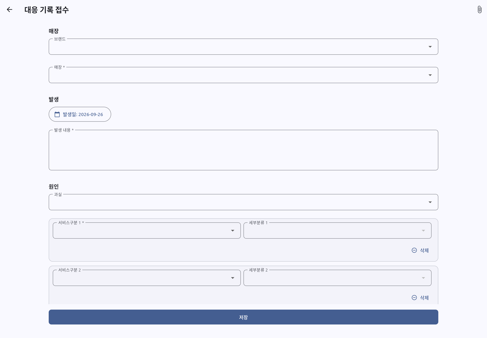

*화면 05. 대응 기록 접수: 매장, 발생 내용, 원인을 위에서부터 입력합니다. 아래로 스크롤하면 대응인원·렌탈·기타 항목이 있습니다.*

1. 접수 목록 오른쪽 위 **+ 접수**를 누릅니다. 상단의 매장·발생·원인·대응·렌탈·기타 버튼으로 입력 구역을 바로 이동할 수 있습니다.
2. **브랜드 → 매장** 순으로 선택합니다. 매장은 필수입니다. 폐점 매장은 경고 내용을 확인한 뒤 계속 진행할 수 있습니다.
3. **발생일**을 확인하고 **발생 내용**을 작성합니다. 첫 줄에 핵심 증상을 적으면 목록에서 알아보기 쉽습니다.
4. **과실**과 서비스구분을 지정하고 해당 구분에 필요한 세부분류·제조사·증상 등을 선택합니다. 분류에 따라 필수 항목이 달라집니다.
5. 원인이 여러 가지라면 **서비스구분 추가**를 사용합니다. 동일 현상을 무조건 별도 접수로 나누지 말고 실제 대응 단위에 맞게 기록합니다.
6. **대응인원**에서 실제 담당자를 선택합니다.
7. 필요하면 렌탈과 기타 정보를 입력합니다.
8. **저장** 또는 **저장 후 첨부**를 누릅니다. 등록된 접수번호와 매장명을 상세 화면에서 확인합니다.

입력 예: 발생 내용 첫 줄은 “서울점 로봇 동작 중 간헐 정지”, 다음 줄에는 발생 시각·재현 조건·현장 조치 내용을 적습니다. 연락처와 현장 주소는 업무상 필요한 정보만 입력하세요.

### 3. 상세 확인·작업 기록·종결

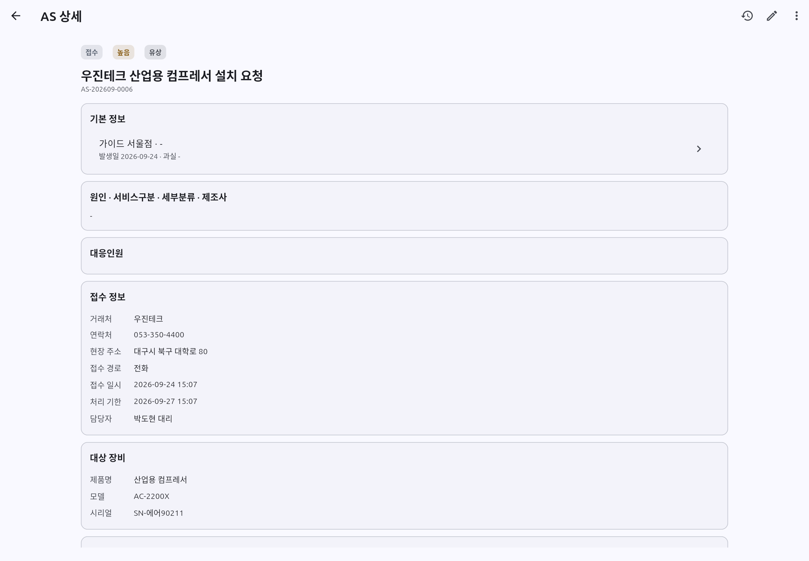

*화면 25. AS 상세: 접수 내용, 처리 상태, 사용 부품, 처리 이력과 첨부를 확인합니다.*

1. 접수 목록에서 해당 기록을 엽니다.
2. 현재 상태, 발생 내용, 매장·장비 정보를 확인합니다.
3. 진행 상황은 **작업 기록**으로 남깁니다. 기록 본문과 작업 시간을 필요에 따라 입력합니다.
4. 사용한 부품은 **부품 추가**로 등록합니다. 재고를 연결하면 서버의 부품 자동 차감 설정이 적용되므로 실제 사용 수량을 확인합니다.
5. 상단 **내용 수정**에서 본문을 수정합니다. **수정 이력**에서 변경자·변경 시점·변경 내용을 확인합니다.
6. 작업이 끝나면 상단 고정 영역의 **종결 처리**를 누릅니다. 이 영역은 본문을 스크롤해도 남아 있습니다. 대응 내용, 대응인원, 대응일을 확인하여 저장합니다. 화면이 요구하는 필수 항목이 빠지면 완료되지 않습니다.
7. 종결 후 추가 작업이 필요하면 제공되는 **다시 열기**를 사용하고 사유를 남깁니다.

상태 변경 이력과 일반 작업 기록은 다릅니다. 상태 변경 이력은 임의 삭제 대상으로 취급하지 않습니다. AS 삭제는 팀장 이상 등 해당 권한 규칙을 따릅니다.

### 4. 렌탈 등록과 회수

1. 대응 기록의 입력·수정 화면에서 **렌탈**을 켭니다.
2. 렌탈 장비 종류, **실제 등록된 장비 시리얼**, 회수 예정일을 입력합니다.
3. 저장 후 매장 상세의 렌탈 현황이나 관련 목록에서 연결을 확인합니다.
4. 장비가 돌아오면 해당 기록에서 **회수 여부**를 변경하고 확인 창을 읽습니다.
5. 실제 회수일을 입력해 저장합니다. AS 종결과 렌탈 회수는 각각 실제 업무 상태에 맞춰 확인하세요.

### 5. 자동 통계와 엑셀

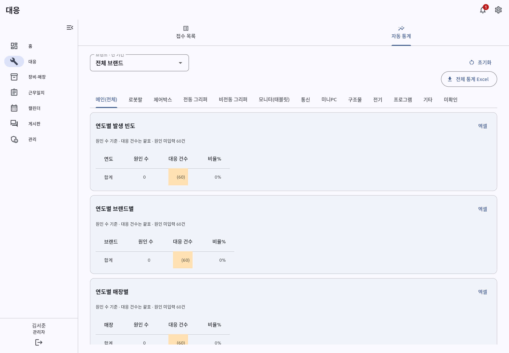

*화면 06. 대응 → 자동 통계: 선택한 기간의 처리 현황과 분포를 확인합니다.*

1. **자동 통계** 탭에서 기간과 필요한 분류 조건을 지정합니다.
2. 합계·완료율 등의 요약과 분류별 분포, 기간별 추이를 함께 읽습니다.
3. 그래프 항목에 마우스를 올리면 제공되는 상세 수치를 확인할 수 있습니다.
4. 상세 조회로 연결되는 항목은 클릭하여 원본 기록을 확인합니다. 분류 미지정 항목도 점검합니다.
5. 엑셀 내보내기로 여러 통계 시트를 내려받습니다. 보고서에는 조회 기간과 조건을 함께 적으세요.

## 매장과 장비 관리

### 1. 전체 현황

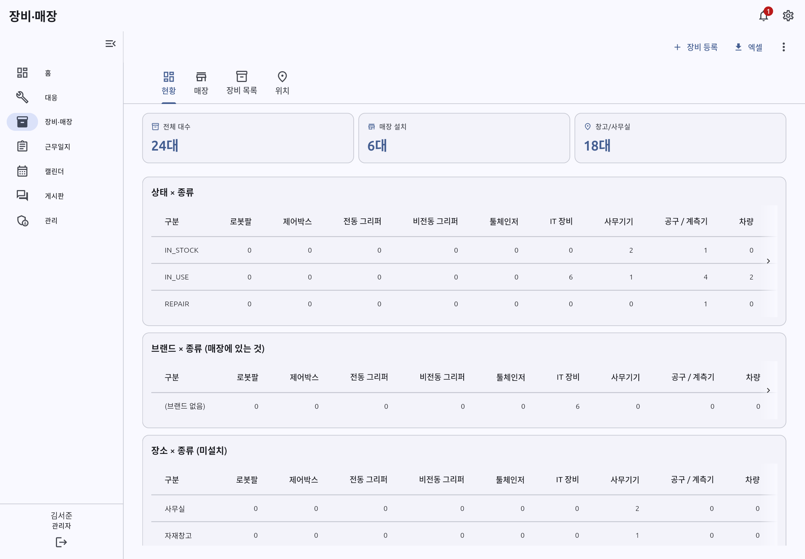

*화면 07. 장비·매장 → 현황: 장비 현황에서 필요한 목록으로 이동합니다.*

**장비·매장** 안에는 **현황 / 매장 / 장비 목록 / 위치** 탭이 있습니다. 회사의 보관 장소는 ‘위치’, 고객사의 설치 장소는 ‘매장’으로 구분합니다. 장비가 어디에 있는지 확인할 때 두 정보를 혼동하지 마세요.

### 2. 매장 조회

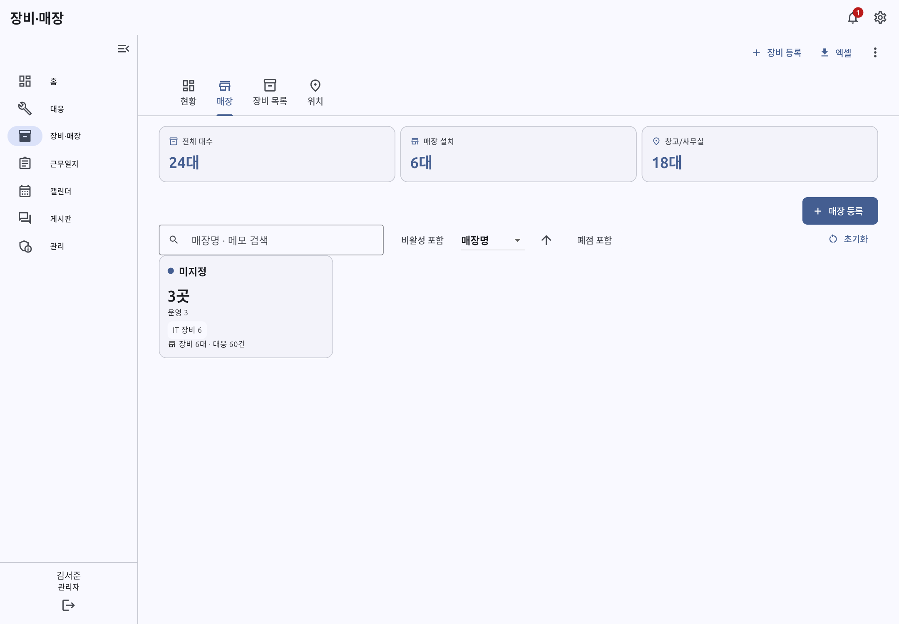

*화면 08. 매장: 브랜드와 운영 상태를 기준으로 대상 매장을 찾습니다.*

1. **매장** 탭에서 브랜드를 선택합니다.
2. 매장 검색어와 운영·폐점 등 조건을 확인합니다.
3. 매장명을 눌러 상세 화면으로 이동합니다.
4. 장비 수, 대응 건수, 미종결 기록, 개점일 등 표시되는 정보를 확인합니다.
5. 폐점 매장이 안 보이면 조회 조건을 확인합니다.

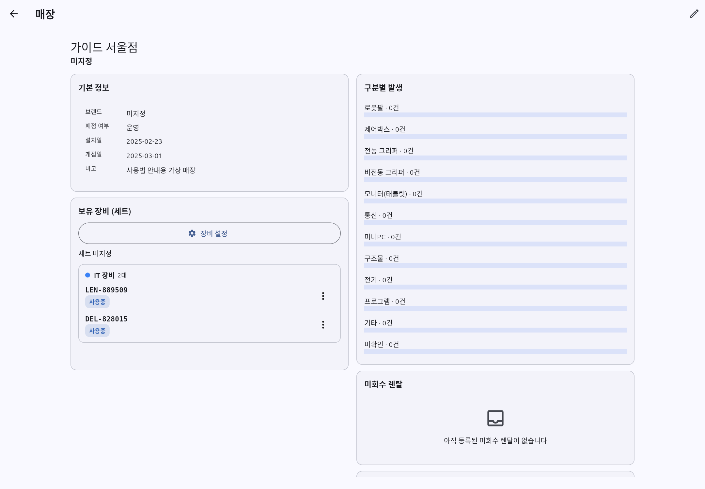

*화면 26. 매장 상세: 납품 장비, 관련 대응, 렌탈과 사진을 한곳에서 확인합니다.*

상세 화면의 **이 매장 기록 추가**를 사용하면 해당 매장을 기준으로 대응 접수를 시작할 수 있습니다. 매장 사진은 매장·로봇·제어반·패널·시리얼 등 제공되는 분류에 맞게 첨부하고, 시리얼 사진은 글자가 읽히는지 업로드 후 확인하세요.

### 3. 매장 정보·장비 설정·폐점

- **매장 정보 수정:** 상단 수정 버튼에서 개점일과 운영 상태 등 필요한 정보를 변경합니다.
- **장비 설정:** 관리자 이상이 매장 상세의 **장비 설정**을 엽니다. 설치일과 납품 세트를 확인하고 전동·비전동 구분, 장비 종류와 시리얼을 실제 구성에 맞게 지정합니다. 세트 추가·이름 저장·세트 변경 기능은 해당 화면의 안내에 따릅니다.
- **폐점 처리:** 관리자 이상이 수행합니다. 연결된 장비와 진행 중인 렌탈을 먼저 확인하고, 화면의 장비 회수·처리 선택과 확인 안내를 따라 저장합니다. 렌탈 중인 장비가 자동으로 모두 회수됐다고 간주하지 마세요.
- **폐점 매장의 AS:** 폐점이라는 이유만으로 접수를 차단하지 않습니다. 경고를 확인한 뒤 필요한 기록을 작성할 수 있습니다.

### 4. 장비 검색과 신규 등록

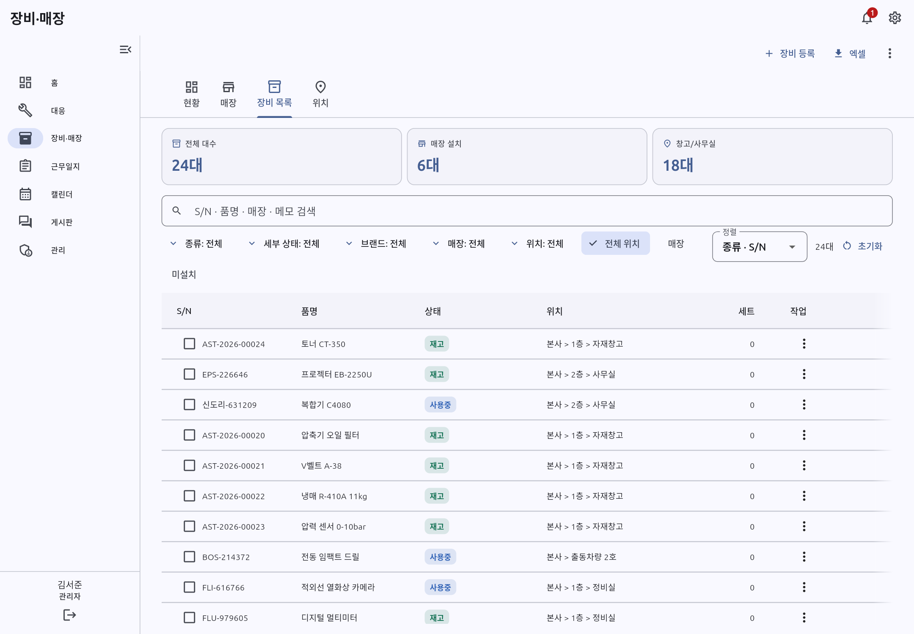

*화면 09. 장비 목록: 시리얼·종류·상태·매장·위치 조건을 확인합니다.*

1. **장비 목록** 탭에서 이름이나 시리얼로 검색합니다.
2. 종류, 상태, 매장·위치 등 조건을 좁힙니다.
3. 장비 행을 눌러 상세 정보를 확인합니다.
4. 새 장비라면 신규 등록 기능을 사용합니다. 동일 시리얼 장비가 이미 있는지 먼저 검색하세요.

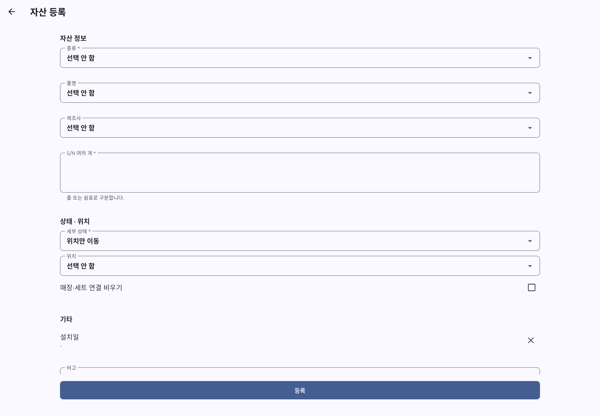

*화면 10. 장비 등록: 실제 장비 식별 정보와 최초 보관 장소를 입력합니다.*

1. **종류**를 선택하고 해당 종류의 **품명**, 필요한 **제조사**를 지정합니다.
2. **S/N 여러 개**에 시리얼을 입력합니다. 여러 대를 한꺼번에 등록할 때는 줄바꿈 또는 쉼표로 구분합니다.
3. **상태 · 위치**에서 상태와 보관 위치 또는 매장을 지정합니다.
4. 필요한 설치일과 비고를 입력하고 **등록**을 누릅니다.
5. 목록과 상세에서 등록된 시리얼, 종류, 위치를 확인합니다. 장비명·모델 등 추가 정보는 상세의 수정 기능에서 확인합니다.

같은 시리얼을 중복 입력하지 않도록 원본 목록을 먼저 확인하세요. 자동으로 만들어지는 식별자는 해당 작업 화면의 안내를 따릅니다.

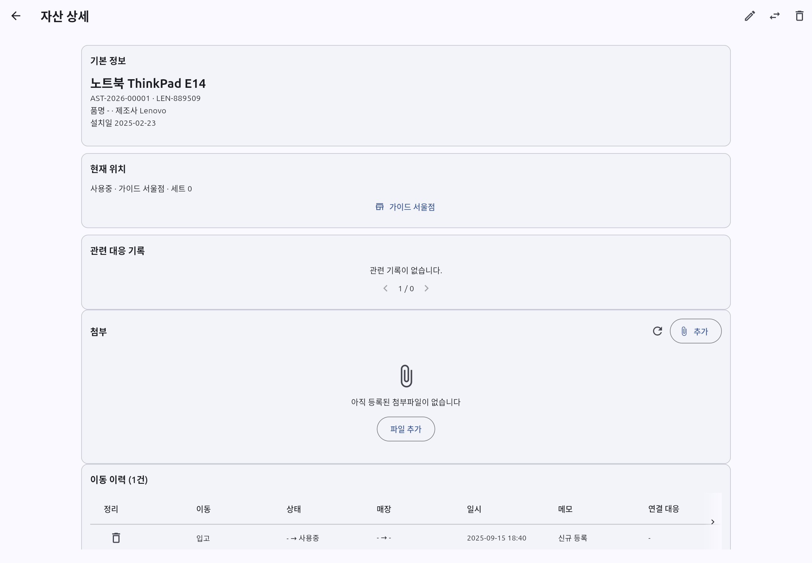

*화면 27. 장비 상세: 현재 상태, 이동 이력, 관련 대응 기록과 첨부를 확인합니다.*

### 5. 장비 이동·상태 변경

1. 대상 장비의 상세 또는 작업 메뉴를 엽니다.
2. **이동 / 상태 변경**을 선택합니다.
3. 목적지 매장 또는 위치, 적용할 상태와 메모를 확인합니다.
4. 저장 후 상세 화면의 현재 위치와 이동 이력을 확인합니다.
5. 매장 설치 장비를 회수할 때는 제공되는 **매장에서 빼기 → 창고** 기능을 사용합니다.

장비 삭제와 장비 이동은 다릅니다. 현장에 있던 장비가 창고로 돌아왔으면 이동 기록으로 남겨야 합니다. 삭제 권한이 없으면 관리 담당자에게 요청하세요.

### 6. 보관 위치 관리

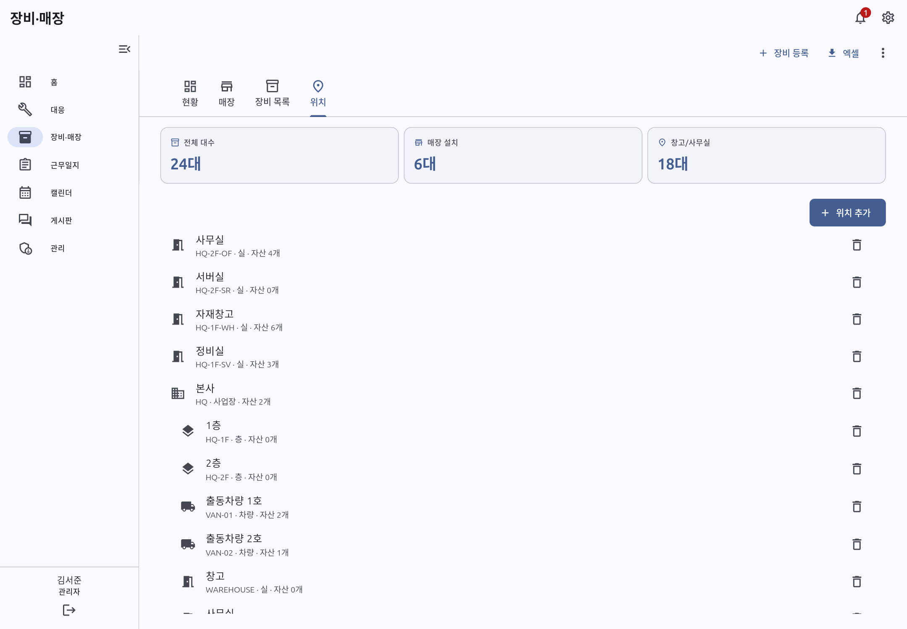

*화면 11. 위치: 회사의 보관 장소를 계층 구조로 관리합니다.*

사업장 → 층 → 구역·랙처럼 실제 찾을 수 있는 이름을 사용합니다. 위치를 정리하기 전에는 해당 위치에 남아 있는 장비를 확인하세요. 고객 매장을 창고 위치로 중복 등록하지 않습니다.

### 7. 출고 대조

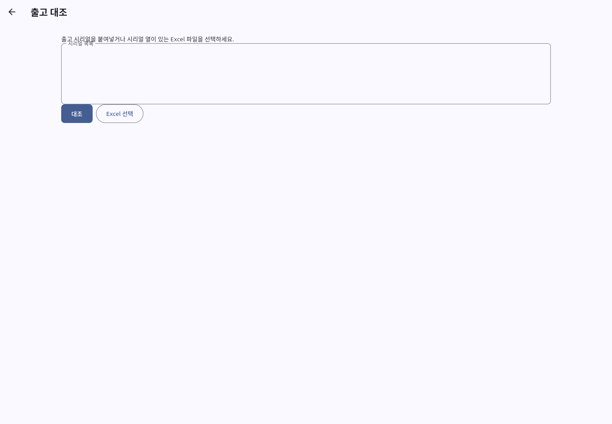

*화면 28. 출고 대조: 준비한 시리얼 목록과 등록된 장비를 비교합니다.*

1. 매장 상세에서 **출고 대조**를 엽니다.
2. 준비한 장비의 시리얼을 붙여넣거나 `S/N` 열을 포함한 엑셀 파일을 선택합니다.
3. 대조를 실행하고 일치·누락·추가·중복 등의 결과를 확인합니다.
4. 불일치 항목은 시리얼 오타와 실제 장비를 확인합니다.
5. 필요한 장비 이동이나 설치 등록은 해당 업무 화면에서 따로 수행합니다. **대조만으로 장비의 위치가 바뀌지는 않습니다.**

## 게시판

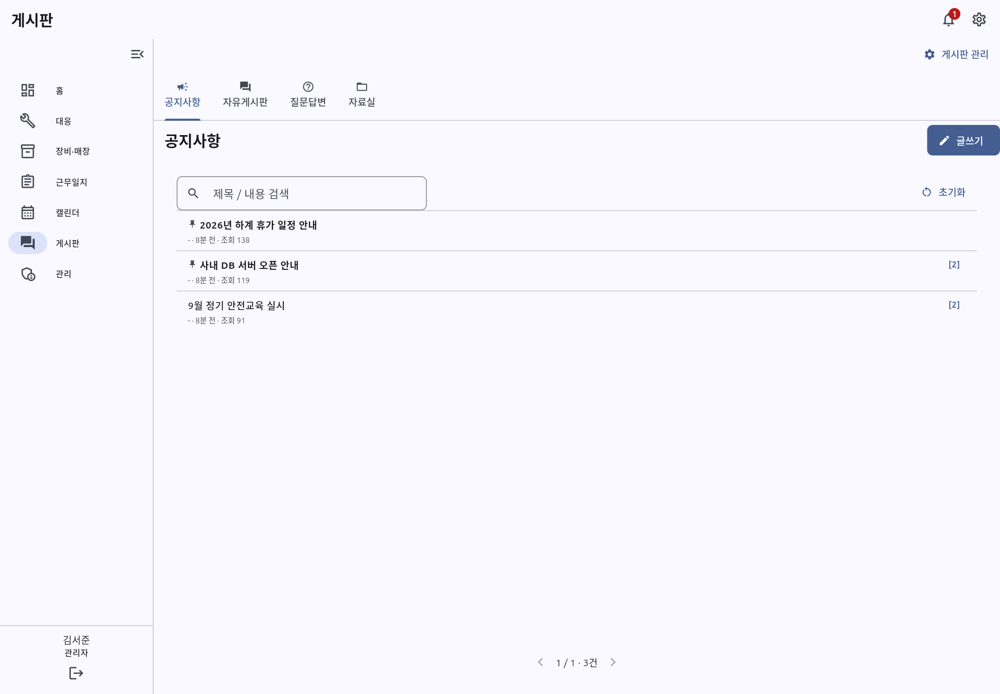

*화면 12. 게시판: 사용할 게시판을 선택하고 게시글을 확인합니다.*

1. **게시판** 메뉴에서 공지·자료 등 목적에 맞는 게시판을 선택합니다.
2. 글 제목을 눌러 본문과 댓글, 첨부를 확인합니다.
3. 작성 권한이 있으면 글쓰기 기능으로 제목과 본문을 입력합니다.
4. 고정·비공개 등 옵션이 표시되면 목적에 맞게 선택합니다. 비공개 자료는 일반 공개 글과 접근 범위가 다릅니다.
5. 저장 후 첨부 영역에서 자료를 추가하고 다시 열어 확인합니다.
6. 댓글로 의견을 남깁니다. 글·댓글의 수정과 삭제는 작성자 및 관리 권한 규칙을 따릅니다.

관리자는 게시판 관리 기능에서 게시판 유형·활성 여부·읽기 및 쓰기 권한·첨부 허용을 설정합니다. 글쓰기 버튼이 없으면 게시판별 작성 권한을 확인하세요.

## 캘린더와 일정

### 1. 일정 보기

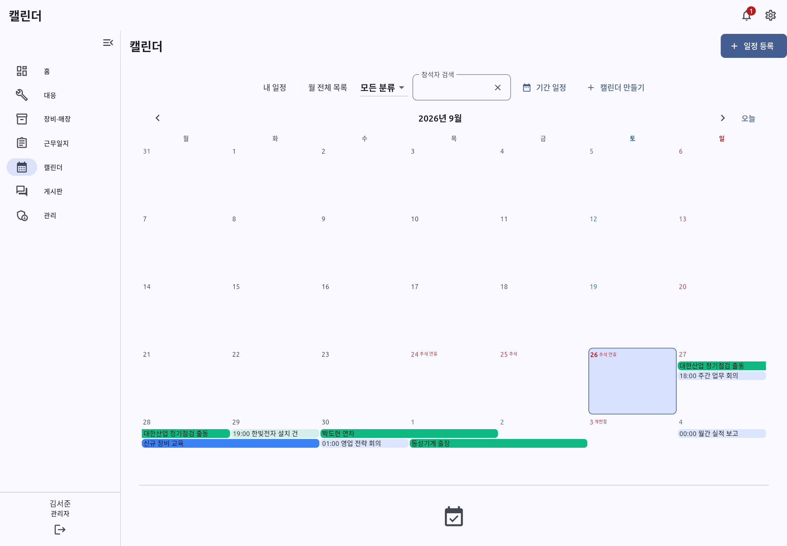

*화면 13. 캘린더: 월 달력과 선택한 날짜의 일정을 확인합니다.*

1. **캘린더**에서 원하는 월로 이동합니다.
2. 날짜를 선택하여 해당 날짜의 일정을 확인합니다.
3. 내 일정, 구분, 참석자 등 필터를 사용합니다. 일정이 안 보이면 기존 필터를 해제합니다.
4. 일정 항목을 눌러 장소·시간·참석자·설명을 확인하고, 참석 응답 기능이 있으면 응답합니다.
5. 여러 날짜에 걸친 일정은 달력에서 기간을 확인합니다.

### 2. 일정 등록

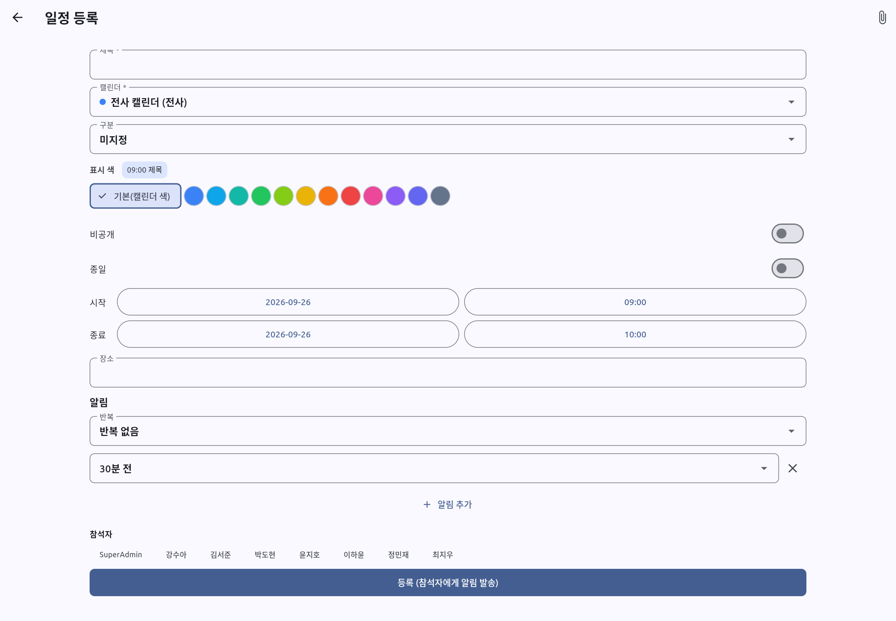

*화면 14. 일정 등록: 시간과 공개 범위, 알림, 반복 조건을 확인합니다.*

1. 새 일정 등록 버튼을 누릅니다. 데스크톱에서는 기간 선택 기능을 켠 뒤 달력에서 시작일부터 종료일까지 드래그하여 여러 날을 선택할 수도 있습니다.
2. 제목과 사용할 **캘린더**를 선택합니다. 개인·회사·부서 캘린더 중 작성 권한이 있는 캘린더를 사용합니다.
3. 구분과 공개 관련 옵션을 확인합니다.
4. 시작·종료를 지정합니다. 종일 일정이면 종일 옵션을 사용하고 날짜 범위를 확인합니다.
5. 장소, 설명, 참석자를 입력합니다.
6. 필요하면 **알림 추가**로 사전 알림 시간을 지정합니다.
7. 반복 일정이면 반복 주기와 종료일을 설정합니다.
8. 저장 후 달력에서 실제 날짜와 시간을 확인합니다. 자료가 있으면 저장 후 첨부합니다.

### 3. 반복 일정 수정과 삭제

반복 일정의 원본과 개별 발생 일정은 적용 범위가 다릅니다. 원본 수정은 이후 발생분에 영향을 줄 수 있고, 개별 일정 수정은 해당 회차를 대상으로 합니다. 변경·삭제 전에 현재 열어 둔 일정과 적용 범위 안내를 확인하세요. 지난 일정이 보존되고 향후 일정만 정리되는 경우도 있으므로 삭제 후 해당 월을 다시 확인합니다.

## 근무일지

### 1. 조회

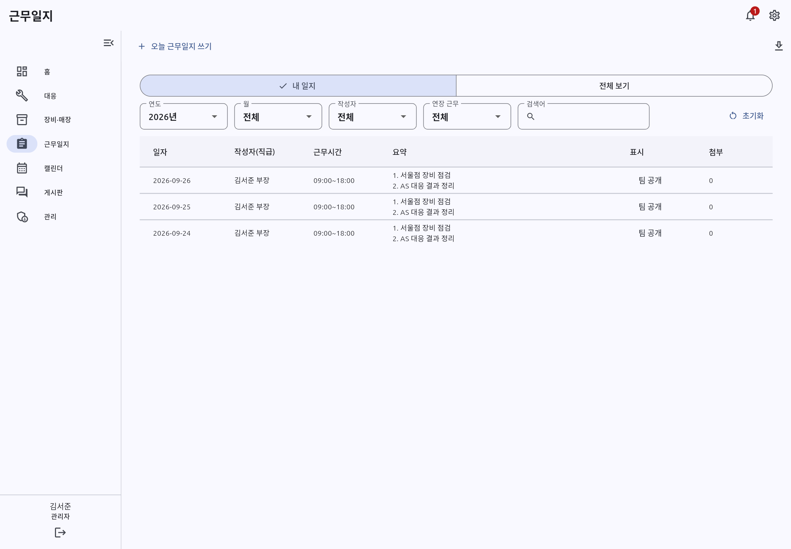

*화면 15. 근무일지: 내 일지와 공개된 일지를 조건에 맞게 조회합니다.*

1. **근무일지** 메뉴를 엽니다.
2. 내 일지·공개 조회 범위를 선택하고 연도·월·작성자·검색어 등 조건을 지정합니다.
3. 일자를 눌러 상세를 확인합니다.
4. 엑셀 내보내기를 사용할 경우 조회 범위와 기간을 확인한 뒤 내려받습니다.

### 2. 작성·임시 저장·첨부

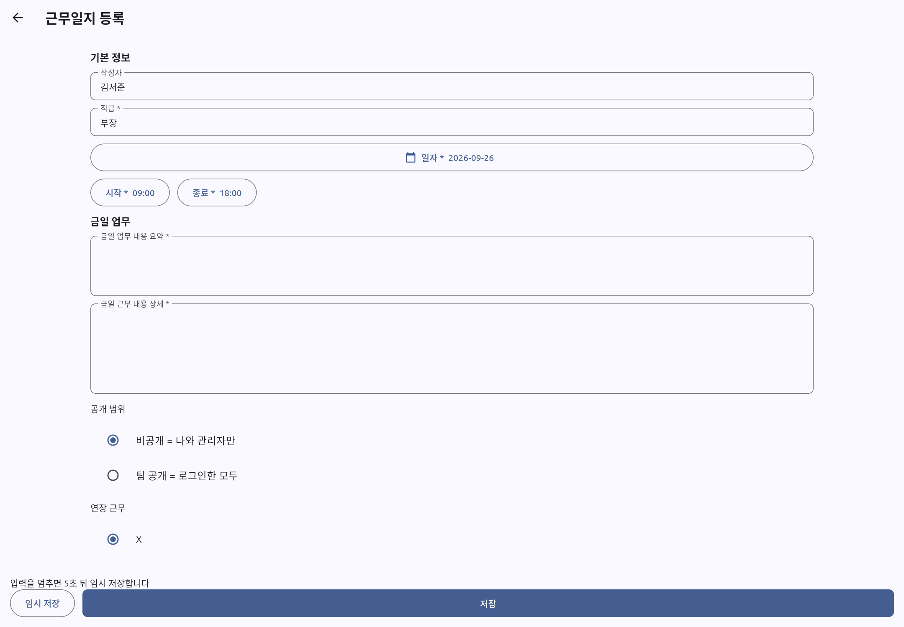

*화면 16. 근무일지 작성: 근무 시간, 요약·상세, 공개 범위를 함께 기록합니다.*

1. 새 일지 작성 기능을 엽니다.
2. 작성자와 직급, 일자, 시작·종료 시간을 확인합니다.
3. 당일 업무 요약은 한 줄에 하나씩 작성합니다. 상세에는 결과와 후속 조치를 적습니다.
4. 예정 업무와 필요·요청사항을 입력합니다.
5. 연장 근무 여부를 지정하고 필요한 사유를 입력합니다.
6. 공개 범위를 선택합니다. **비공개 = 나와 관리자만**, **팀 공개 = 로그인한 모두**입니다. ‘팀 공개’를 같은 부서 사람만 보는 범위로 해석하지 마세요.
7. 아직 작성 중이면 **임시 저장**을 사용합니다. 이후 작성 화면에서 임시 내용을 불러오거나 버리고 새로 쓸 수 있습니다.
8. 작성이 끝나면 등록·저장하고 상세 화면에서 첨부를 추가합니다.

임시 저장은 최종 등록과 다릅니다. 일지 목록에서 해당 일자가 실제 등록되었는지 확인하세요. 같은 작성자의 같은 날짜 일지는 기존 자료를 확인한 뒤 수정합니다.

## 알림과 Android 기기 설정

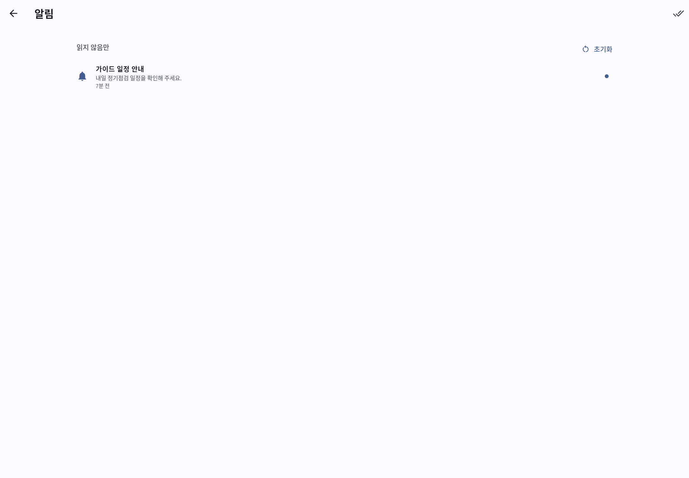

*화면 17. 알림: 읽지 않은 알림을 확인하고 관련 자료로 이동합니다.*

### 앱 안의 알림

1. 오른쪽 위 알림 아이콘을 누릅니다.
2. 읽지 않은 알림을 중심으로 확인합니다.
3. 알림을 누르면 연결된 일정·업무가 있는 경우 상세로 이동합니다.
4. 확인한 알림은 읽음 처리합니다. 제공되는 전체 읽음 기능은 목록 내용을 확인한 뒤 사용합니다.

앱 안의 알림 목록과 휴대폰 푸시는 별개입니다. 이 문서 작성 시 Firebase 운영 설정은 제공되지 않았으므로, 실제 휴대폰 푸시가 활성화되었다고 전제하지 않습니다.

### Android 일정 알람

Android 앱에서 지원되는 알람 설정·저장된 알람 화면을 사용합니다. 데스크톱 캡처에는 Android 전용 버튼이 나타나지 않습니다.

1. 휴대폰에서 로그인하고 일정을 동기화합니다.
2. 앱이 요청하는 알림·정확한 알람 등 필요한 권한을 확인합니다.
3. 알람 설정에서 사용할 동작을 확인합니다.
4. **이 폰에 저장된 알람 보기**에서 실제 예약된 알람을 확인합니다.
5. 짧은 시험 일정을 만들어 울림과 해제를 확인합니다. 기기 설정에 따라 백그라운드·배터리 제한의 영향을 받을 수 있으므로 운영 전 해당 휴대폰에서 확인합니다.

서버의 일정을 바꾼 뒤에는 휴대폰이 다시 연결되어 변경 내용을 반영해야 합니다. 다른 기기에서 일정을 수정했다고 해서 오프라인 휴대폰의 예약 내용이 즉시 바뀌지는 않습니다.

### Android VPN

사내 서버가 VPN 안에서만 열리는 환경이라면 관리자가 제공한 WireGuard 설정을 사용합니다. Android의 VPN 설정 화면에서 제공되는 설정 가져오기 또는 QR 방식으로 등록하고, 운영체제 연결 동의를 완료한 뒤 서버 접속을 확인합니다. 설정 파일과 QR에는 접속 자격 정보가 들어갈 수 있으므로 사용법 문서나 게시글에 올리지 않습니다. 도메인·허용 네트워크는 설치 환경마다 다릅니다.

## 내 정보와 로그인 기기

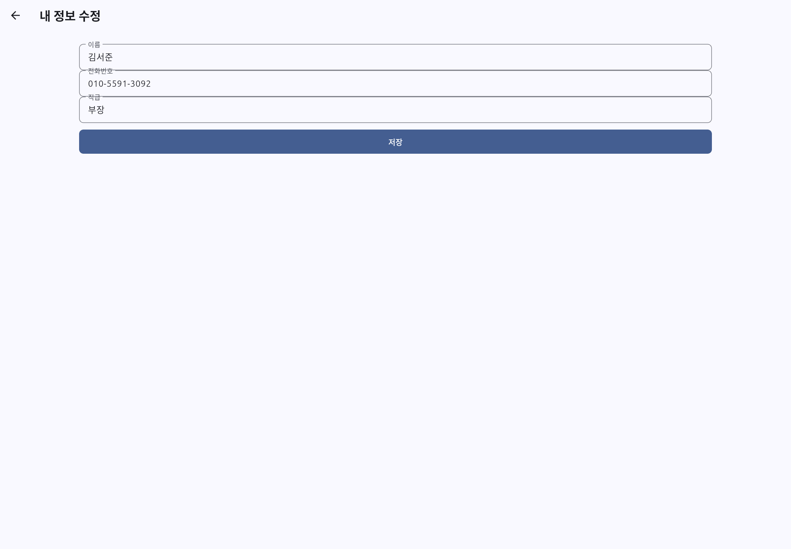

*화면 18. 내 정보: 이름·연락처·직급 등 수정 가능한 정보를 관리합니다.*

1. 오른쪽 위 계정 메뉴에서 **내 정보 수정**을 엽니다.
2. 변경 가능한 정보를 수정하고 저장합니다.
3. 이메일·역할 등 직접 바꿀 수 없는 항목은 관리자에게 문의합니다.
4. 비밀번호는 계정 메뉴의 비밀번호 변경 기능으로 변경합니다. 비밀번호 변경 후에는 다시 로그인이 필요합니다.

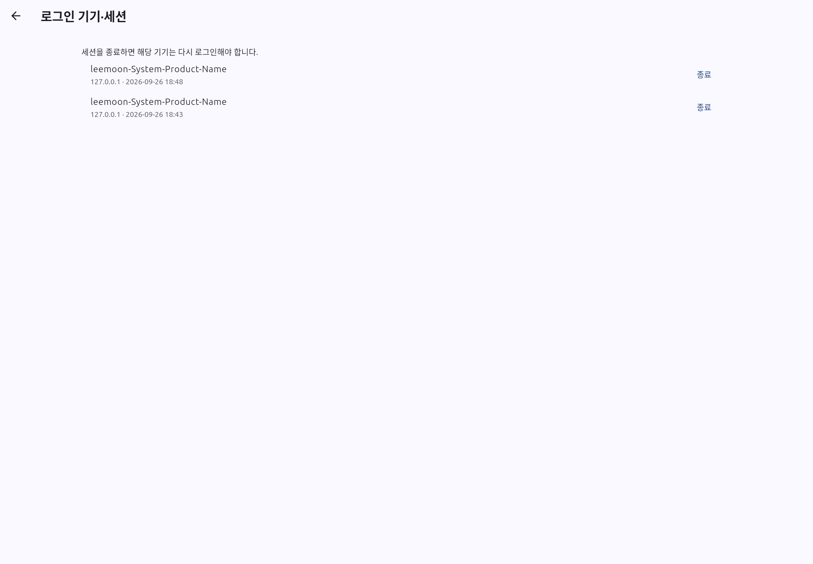

*화면 19. 로그인 기기·세션: 여러 기기의 접속을 확인하고 필요 없는 세션을 종료합니다.*

여러 기기에서 동시에 로그인할 수 있습니다. **로그인 기기·세션**에서 기기 정보와 접속 시점을 확인하고 사용하지 않는 세션의 **종료**를 누릅니다. 세션을 종료한 기기는 다시 로그인해야 합니다. 알 수 없는 접속이 있으면 해당 세션을 종료하고 비밀번호를 변경하세요.

공용 기기에서는 창을 닫는 것만으로 끝내지 말고 **로그아웃**을 선택합니다.

## 관리자 업무

### 1. 가입 승인

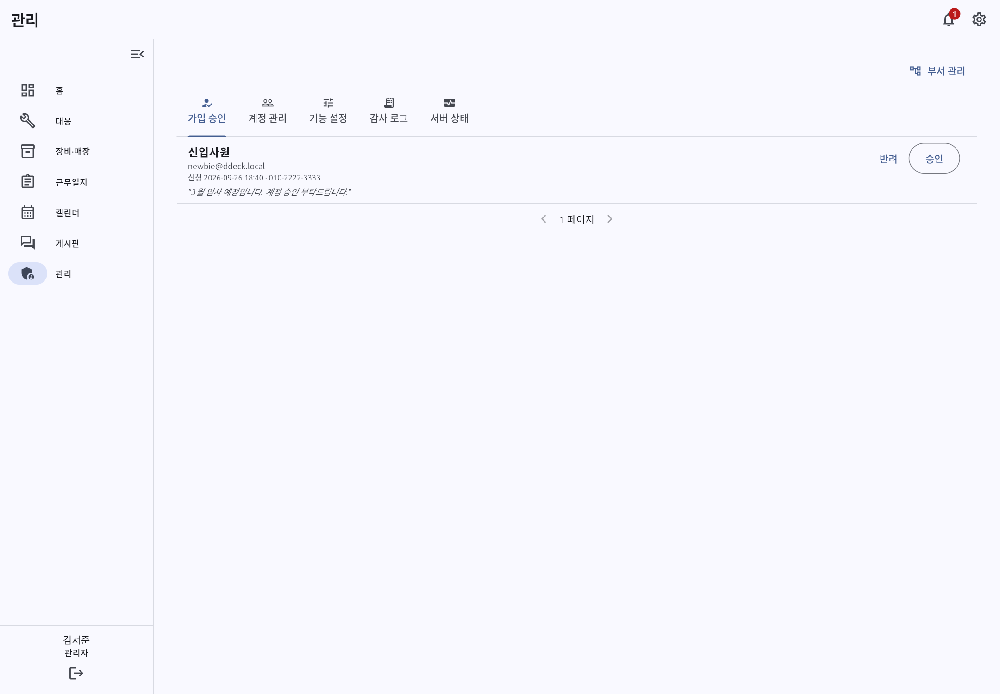

*화면 20. 관리 → 가입 승인: 신청자의 소속과 권한을 확인합니다.*

1. **관리 → 가입 승인**을 엽니다.
2. 이름·이메일·신청 메모를 확인합니다.
3. 실제 직원 여부와 필요한 부서·역할을 확인하고 승인합니다.
4. 승인할 수 없는 신청은 화면 안내에 따라 반려합니다.
5. 신청자에게 승인 결과를 안내하고 로그인을 확인하게 합니다.

편의를 위해 모든 직원을 관리자로 승인하지 마세요. 필요한 업무에 맞는 역할을 사용합니다.

### 2. 계정과 부서 관리

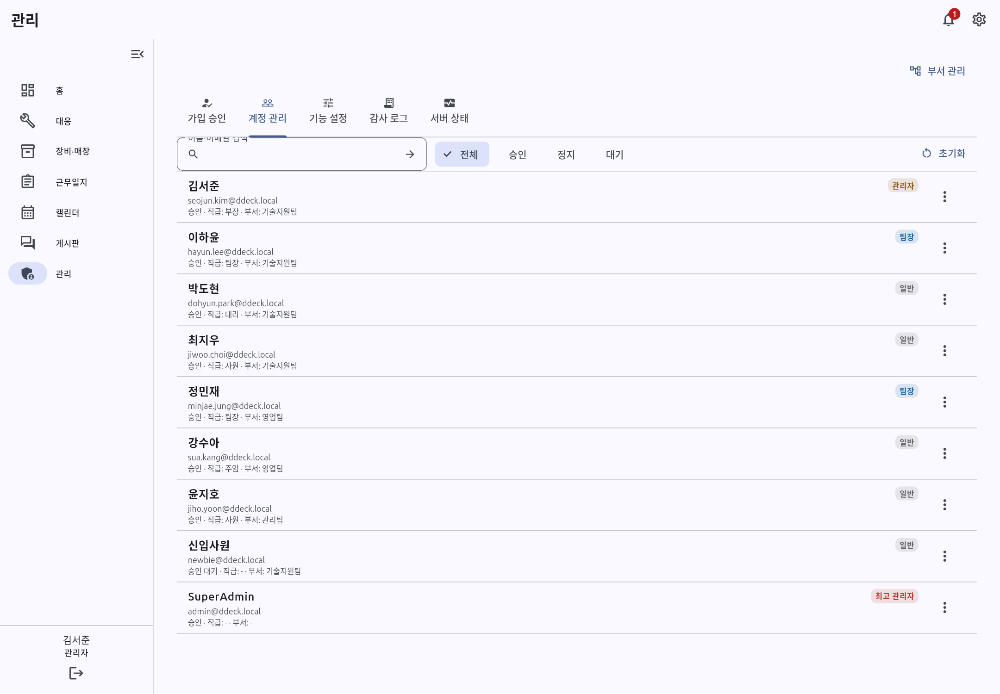

*화면 21. 관리 → 계정 관리: 계정 상태와 역할을 확인합니다.*

1. 검색과 상태 조건으로 대상 계정을 찾습니다.
2. 이름·직급·역할·상태 등 허용된 항목을 변경합니다.
3. 비밀번호 분실 시 초기화 기능을 사용합니다. 표시되는 임시 비밀번호는 승인된 전달 수단으로 본인에게 전달하고 첫 로그인에서 변경하도록 안내합니다.
4. 퇴사·이동자는 회사 정책에 맞춰 상태를 변경합니다. 계정 삭제가 필요한 경우 작성 기록과 권한 제한을 확인합니다.
5. **부서 관리**에서 부서명과 코드를 관리합니다.

동급·상위 계정 수정이나 마지막 최고관리자 변경 등 보호 규칙에 걸리면 허용되는 관리 계정과 업무 절차를 확인하세요.

### 3. 기능 설정과 분류 코드

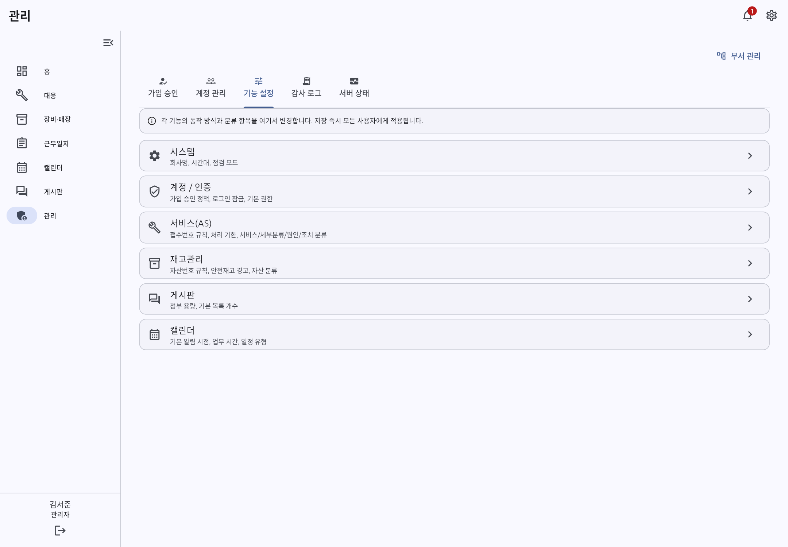

*화면 22. 관리 → 기능 설정: 모듈별 동작과 분류를 관리합니다.*

| 설정 영역 | 확인할 내용 |
| --- | --- |
| 시스템 | 회사명, 시간대, 점검 모드 등 |
| 인증 | 가입 승인 정책, 로그인 잠금, 기본 권한 등 |
| 대응 | 접수번호, 처리 기한, 서비스·세부분류·원인·조치 등의 코드 |
| 장비 | 자산번호, 안전재고, 자산 분류 등 |
| 게시판 | 첨부 제한, 목록 기본값 등 |
| 캘린더 | 기본 알림, 업무 시간, 일정 유형 등 |

1. 바꿀 영역을 선택합니다.
2. 항목 설명과 현재 값을 확인합니다.
3. 필요한 값만 수정하고 저장합니다.
4. 실제 업무 화면으로 돌아가 선택지와 동작을 확인합니다.

설정 저장은 다른 사용자에게도 영향을 줍니다. 분류의 이름·활성 상태·정렬·상하위 관계를 바꿀 때는 기존 기록과 통계에서 어떻게 표시될지 확인하세요. 사용을 중단하는 분류는 제공되는 비활성화 기능을 우선 검토합니다.

### 4. 감사 로그와 수정 이력

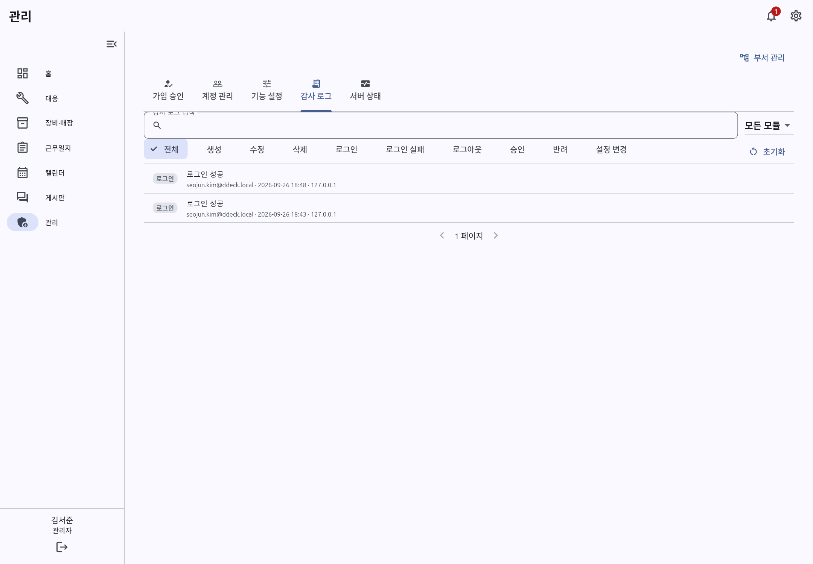

*화면 23. 관리 → 감사 로그: 변경 작업을 모듈과 동작별로 확인합니다.*

검색어, 모듈, 동작 조건으로 범위를 좁히고 누가 언제 어떤 작업을 했는지 확인합니다. AS 개별 기록의 수정 이력과 전체 감사 로그를 함께 보면 변경 경위를 확인하기 쉽습니다.

서버 PC의 로컬 접속에서 관리자에게 보이는 이력 정리 기능은 일반 사용자의 삭제 기능이 아닙니다. 정리 기능은 화면 조회 대상에서 이력을 숨기는 방식이며 원본 기록과 정리 감사 기록은 보존됩니다. 업무 자료 삭제와 혼동하지 마세요.

### 5. 서버 상태와 백업

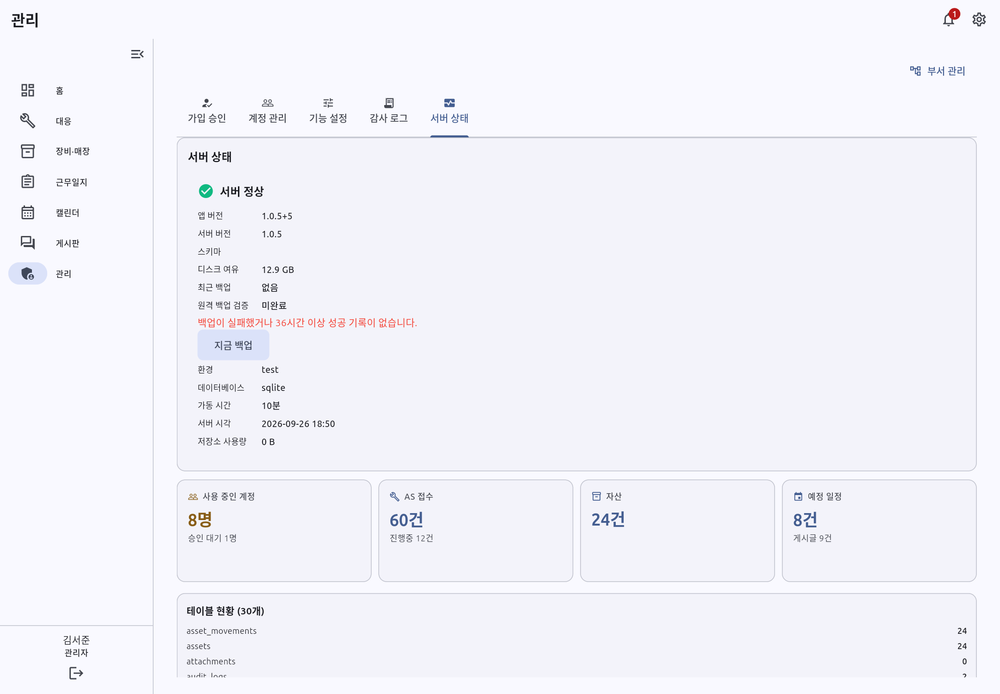

*화면 24. 관리 → 서버 상태: 서버·앱 버전, 데이터베이스, 저장 공간과 백업 상태를 확인합니다. 캡처용 서버는 자동 백업 스케줄러를 끈 시험 환경입니다.*

1. 앱·서버 버전과 연결 상태를 확인합니다.
2. 데이터베이스와 디스크 상태를 확인합니다.
3. 마지막 백업 결과와 경고를 확인합니다.
4. 수동 백업 기능을 사용할 때는 완료 여부를 확인합니다. 서버 설정에 따라 사용이 제한될 수 있습니다.
5. 백업 실패나 오래된 백업 경고가 반복되면 운영 담당자가 서버 로그와 저장 공간, 백업 설정을 점검합니다.

원격 백업, Firebase 푸시, HTTPS·네트워크 제한, Android 릴리스 서명은 설치·운영 준비가 필요합니다. 화면이 있다는 사실만으로 외부 서비스가 연결된 것은 아닙니다. 구체적인 운영 절차는 [운영 가이드](OPERATIONS.md), [PostgreSQL 가이드](POSTGRES.md), [Android 서명 가이드](ANDROID_SIGNING.md)를 참고하세요.

## 자주 발생하는 상황

| 상황 | 먼저 확인할 것 | 다음 조치 |
| --- | --- | --- |
| 서버에 연결되지 않음 | 서버 주소, 사내망·VPN, 서버 실행 상태 | 연결 복구 후 다시 시도합니다. |
| 가입했지만 로그인 불가 | 승인 대기·반려·비활성 여부 | 관리자에게 계정 상태 확인을 요청합니다. |
| 비밀번호 오류·로그인 잠금 | 이메일 오타, 키보드 입력 상태 | 반복 시도를 중단하고 초기화 또는 잠금 정책을 확인합니다. |
| 기존 자료가 안 보임 | 기간·상태·브랜드·내 자료 등의 필터 | 조건을 해제하고 조회 범위를 넓힙니다. |
| 저장 버튼을 눌러도 완료 안 됨 | 별표 항목, 날짜 범위, 분류별 필수값 | 화면의 오류 안내에 표시된 항목을 수정합니다. |
| 폐점 매장 경고 | 선택한 매장이 실제 대상인지 | 맞으면 경고를 확인하고 진행합니다. |
| 수정·삭제 메뉴 없음 | 내 역할, 작성자, 자료 공개 범위 | 권한 있는 담당자에게 요청합니다. |
| 첨부 업로드 실패 | 파일 크기·형식, 서버 연결, 권한 | 제한에 맞게 준비하고 재시도합니다. 본문 저장 여부도 확인합니다. |
| 엑셀 건수가 화면 행 수와 다름 | 전체 검색 결과와 현재 로딩한 행 수 | 조회 조건·기간과 파일 내용을 비교합니다. |
| 휴대폰 알림이 안 옴 | 앱 알림 목록, Firebase 운영 설정, 휴대폰 권한 | 운영 담당자와 실제 기기에서 점검합니다. |
| 일정 알람 시간이 다름 | 시작·종료 시각, 기기 시간대, 동기화 상태 | 기기 시간을 확인하고 일정을 다시 동기화합니다. |
| 세션 종료 후 다시 로그인 요구 | 다른 기기에서 종료 또는 비밀번호 변경 | 승인된 계정으로 다시 로그인합니다. |
| 수동 백업 불가 | 스케줄러·백업 경로·서버 상태 | 운영 가이드에 따라 서버 설정을 확인합니다. |

문의를 전달할 때는 발생 시각, 사용 메뉴, 접수번호·장비 시리얼 등 대상 식별 정보, 화면의 오류 문구를 함께 알려 주세요. 비밀번호·접속 키·토큰은 보내지 않습니다.

## 업무별 빠른 순서표

| 하고 싶은 일 | 이동 순서 | 마무리 확인 |
| --- | --- | --- |
| 새 AS 접수 | 대응 → 접수 목록 → 신규 접수 → 매장·발생·원인 입력 → 저장 | 접수번호, 매장, 발생일 |
| AS 완료 | 대응 → 기록 상세 → 종결 처리 → 대응 내용·인원·일자 → 저장 | 상태와 완료 내용 |
| 현장 사진 첨부 | 기록 상세 → 첨부 또는 작성 화면 → 저장 후 첨부 | 업로드 완료와 미리보기 |
| 렌탈 회수 | 대응 기록 수정 → 렌탈 → 회수 여부·실제 회수일 → 저장 | 회수 표시와 장비 상태 |
| 매장 설치 장비 확인 | 장비·매장 → 매장 → 브랜드 → 매장 상세 | 납품 세트·시리얼 |
| 장비 창고 이동 | 장비·매장 → 장비 목록 → 상세 → 이동 / 상태 변경 | 현재 위치와 이동 이력 |
| 출고 목록 비교 | 매장 상세 → 출고 대조 → 시리얼 또는 엑셀 | 누락·추가·중복 |
| 일정 등록 | 캘린더 → 일정 등록 → 캘린더·시간·참석자 → 저장 | 달력 표시와 알림 |
| 일지 제출 | 근무일지 → 작성 → 시간·업무·공개 범위 → 등록 | 목록에 해당 일자 표시 |
| 사용하지 않는 기기 종료 | 계정 메뉴 → 로그인 기기·세션 → 종료 | 대상 기기 재로그인 요구 |
| 직원 가입 승인 | 관리 → 가입 승인 → 신청 확인 → 승인 | 계정 역할·상태 |
| 백업 상태 확인 | 관리 → 서버 상태 | 마지막 성공 시각과 오류 |

### 안내 자료와 캡처 원본

- [브라우저용 가이드](사용자-가이드.html): 이미지가 포함된 단일 HTML 파일입니다.
- [인쇄용 PDF](사용자-가이드.pdf): 배포·인쇄용 문서입니다.
- [화면 이미지 폴더](images/user-guide/): 원본 PNG 캡처입니다.
- [개선 검토 및 구현 기록](개선검토-2026-09-26.md): 기능별 변경 기록입니다.
